# DreamHub 后端开发综合计划

基于 `README.md` 和 `PLAN.md` 的分析，制定以下后端开发综合计划，涵盖核心功能、基础架构、安全性、DevOps、开发者体验和未来增强等方面。

## 计划概览图 (Mermaid)

```mermaid
graph TD
    subgraph "核心功能 (Core Features)"
        direction LR
        F1[1.1 用户数据隔离]
        F2[1.2 异步任务处理]
        F3[1.3 对话历史与摘要]
        F4[1.4 WebSocket 实时通信]
    end

    subgraph "基础架构与健壮性 (Foundation)"
        direction LR
        B1[2.1 统一错误处理]
        B2[2.2 统一日志记录]
        B3[2.3 外部API韧性]
        B4[2.4 数据一致性]
    end

    subgraph "安全性 (Security)"
        direction LR
        S1[3.1 身份验证与授权]
        S2[3.2 Secrets 管理]
        S3[3.3 文件上传安全]
    end

    subgraph "DevOps 与生产就绪 (DevOps & Prod Ready)"
        direction TB
        D1[4.1 CI/CD 流程]
        D2[4.2 容器化]
        D3[4.3 监控与告警]
        D4[4.4 部署策略]
        D5[4.5 数据管理]
        D6[4.6 合规性]
    end

    subgraph "开发者体验 (DevEx)"
        direction LR
        E1[5.1 本地环境]
        E2[5.2 代码质量]
        E3[5.3 自动化测试]
        E4[5.4 辅助脚本]
    end

    subgraph "未来增强 (Future)"
        direction LR
        O1[6.1 插件化 RAG]
        O2[6.2 微调流水线]
        O3[6.3 可视化面板]
    end

    %% 主要依赖关系
    F1 & F2 & F3 & F4 --> B1 & B2 & B3 & B4 & S1 & S2 & S3 & D1 & D2 & D3 & D4 & D5 & D6 & E1 & E2 & E3 & E4

    classDef core fill:#cde4ff,stroke:#36c,stroke-width:2px;
    classDef foundation fill:#ddf1d4,stroke:#383,stroke-width:2px;
    classDef security fill:#fff0cc,stroke:#a50,stroke-width:2px;
    classDef devops fill:#e4ccf9,stroke:#539,stroke-width:2px;
    classDef devex fill:#f9d4e1,stroke:#b27,stroke-width:2px;
    classDef future fill:#d4f1f9,stroke:#05a,stroke-width:2px;

    class F1,F2,F3,F4 core;
    class B1,B2,B3,B4 foundation;
    class S1,S2,S3 security;
    class D1,D2,D3,D4,D5,D6 devops;
    class E1,E2,E3,E4 devex;
    class O1,O2,O3 future;

```

## 1. 核心功能实现与完善 (Core Features)

*   **1.1 用户数据隔离 (Data Isolation):**
    *   在 Repository 层强制加入 `user_id` / `tenant_id` 过滤。
    *   建立 `pkg/ctxutil` 包，规范 Context 传递 `user_id`, `trace_id` 等。
    *   确保向量库和对话历史的严格隔离。
*   **1.2 异步任务处理 (Async Task Processing):**
    *   使用 Asynq + Redis 实现任务队列。
    *   实现 Worker 处理 Embedding (分块、调用 LLM、存储)。
    *   创建 `task` 实体和 `task_repo` 用于状态管理。
    *   提供 `/api/v1/tasks/{task_id}/status` API。
    *   实现任务幂等性 (基于 `file_hash` 或 `chunk_hash`)。
    *   优化大文件处理 (分段事务或批处理)。
    *   增加队列保护机制 (如 `MAXLEN`) 防止爆仓。
*   **1.3 对话历史与摘要 (Conversation & Summarization):**
    *   创建 `chat_repo` 并迁移数据库逻辑。
    *   实现 `memory_service` 进行对话摘要。
    *   设计数据库表存储摘要和管理长对话上下文。
*   **1.4 WebSocket 实时通信 (Real-time Communication):**
    *   搭建 WebSocket 服务器 (Hub 管理连接, 认证)。
    *   Worker 通过 Hub 推送任务进度。
    *   Chat Service 支持流式响应并通过 WebSocket 发送。(TODO 2025-04-26: 当前 `openai_provider.go` 中的流式实现是临时的，因 `langchaingo` API 问题待查，暂时使用非流式替代。)
    *   考虑 Hub 的高可用性 (如 Redis Pub/Sub)。

## 2. 基础架构与健壮性 (Foundation & Robustness)

*   **2.1 统一错误处理 (Error Handling):**
    *   完善 `pkg/apperr` 定义应用错误。
    *   使用 Gin 中间件统一捕获和格式化错误响应。
*   **2.2 统一日志记录 (Logging):**
    *   完善 `pkg/logger` (如使用 slog/zap)。
    *   实现结构化日志，并在关键路径添加 Trace ID。
*   **2.3 外部 API 调用韧性 (External API Resilience):**
    *   为 OpenAI 等调用添加指数退避重试、速率限制。
    *   实现 API Key 轮换和额度监控与告警。
*   **2.4 数据一致性 (Data Consistency):**
    *   在 Service 层协调 PostgreSQL 和 PGVector 的写入，使用事务或 Outbox Pattern。

## 3. 安全性 (Security)

*   **3.1 身份验证与授权 (AuthN & AuthZ):**
    *   实现基于 Token (如 JWT) 的用户认证。
    *   在 API 和 WebSocket 入口强制执行认证。
*   **3.2 Secrets 管理 (Secrets Management):**
    *   使用专用工具 (Vault, AWS Secrets Manager 等) 或安全机制管理敏感信息。
    *   实现密钥轮换。
*   **3.3 文件上传安全 (Secure File Upload):**
    *   实现 MIME 类型白名单过滤。
    *   (推荐) 集成病毒扫描 (如 ClamAV)。

## 4. DevOps 与生产就绪 (DevOps & Production Readiness)

*   **4.1 CI/CD 流程 (CI/CD Pipeline):**
    *   使用 GitHub Actions 自动化测试、构建 Docker 镜像、推送到仓库 (如 GHCR)。
    *   实现手动触发部署到测试服务器。
*   **4.2 容器化 (Containerization):**
    *   为 `server` 和 `worker` 编写 Dockerfile。
    *   创建 `docker-compose.yml` 用于本地开发和测试服务器部署。
*   **4.3 监控与告警 (Monitoring & Alerting):**
    *   (推荐) 集成 OpenTelemetry (Tracing) + Prometheus (Metrics) + Grafana (Dashboard)。
    *   监控关键指标 (队列深度、延迟、错误率、资源使用、成本)。
    *   设置告警规则 (如队列积压、额度不足)。
*   **4.4 部署策略 (Deployment Strategy):**
    *   为应用和数据添加版本管理。
    *   (推荐) 采用蓝绿部署或 Canary 发布策略。
*   **4.5 数据管理 (Data Management):**
    *   (推荐) 建立数据库备份和恢复演练流程。
    *   优化数据库性能 (索引、Vacuum)。
*   **4.6 合规性 (Compliance):**
    *   (如果需要) 实现 GDPR 等法规要求的数据删除流程。

## 5. 开发者体验 (Developer Experience)

*   **5.1 本地开发环境:** 确保 `docker-compose up` 能快速启动所有依赖。
*   **5.2 代码质量:** (推荐) 使用 `pre-commit` hooks 运行 linters 和格式化工具。
*   **5.3 自动化测试:** 编写单元测试，(推荐) 建立端到端测试流程。
*   **5.4 辅助脚本:** 提供 `make dev-up`, `scripts/post-merge.sh` 等提高效率。

## 6. (可选) 未来增强 (Future Enhancements)

*   插件化 RAG 数据源。
*   模型微调流水线。
*   可视化监控面板 (任务、知识库增长)。