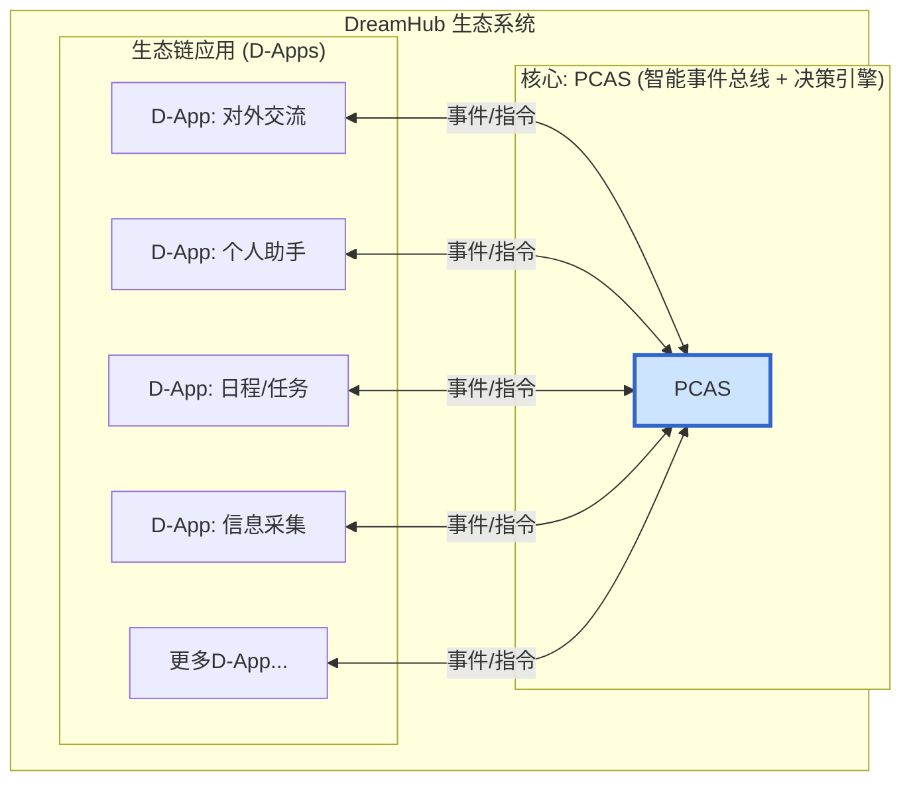

# DreamHub 生态核心: PCAS 架构计划 (v4.0 - Final)

## 1. 核心原则与愿景

### 1.1. 终极愿景: 自有数据集与个人模型

DreamHub 生态的最终目标，是让用户拥有并掌控一个完全属于自己的、高质量的私有数据集。这个数据集由PCAS在日常工作中，通过整合、处理和记录用户的所有数字化交互而形成。

最终，用户将可以使用这个独一无二的数据集，去微调甚至训练一个真正懂自己、只为自己服务的个人AI模型。这是我们实现真正“个人人工智能”的路径。

### 1.2. 核心原则: 数据主权与可信智能

PCAS 的首要设计原则是 **开源、本地化、私有化**。我们坚信，真正的个人AI必须建立在用户对自身数据绝对控制的基础之上。

与依赖云端处理大量敏感数据的模式不同，DreamHub生态致力于：
*   **数据主权:** 用户的敏感数据应尽可能保留在本地。
*   **高效利用资源:** 用尽可能小的本地资源，实现尽可能强大的智能。
*   **可信与透明:** 通过开源，建立一个用户可以审查和信任的系统。

### 1.2. 核心定位: “个人决策中心”而非“应用工厂”

**DreamHub** 是我们的生态系统品牌，致力于在上述原则下，提供整合化的个人AI体验。

为了实现这一愿景，我们将在其内部构建一个独一无二的智能中枢，命名为 **Personal Central AI System (PCAS)**。

为了实现这一愿景，我们将在其内部构建一个独一无二的智能中枢，命名为 **Personal Central AI System (PCAS)**。

PCAS 的定位不是一个像 Dify 那样的通用“应用构建平台”，而是一个服务于单个用户的“**个人决策中心**”。一个绝佳的类比是：**英国签证的“UKVI决策中心”**。

它的核心价值在于其自身的**决策与实时规划能力**。它像一个决策中心，从所有D-App（信息渠道）汇集信息，然后基于一套复杂的内部规则和AI的推理判断能力，做出最终决策，并发出指令。

*   **Dify模式 (应用工厂):** 以“应用”为中心，由开发者预先编排固定的、数据驱动的工作流。
*   **PCAS模式 (私人管家):** 以“用户”为中心，由事件驱动，PCAS作为智能体，根据实时上下文动态规划并协调多应用协作。

## 2. PCAS 架构: 智能事件总线模型

PCAS 的架构是一个以它为中心的、网状的、事件驱动的协作网络。

### 2.1. 核心组件

*   **PCAS (决策引擎):**
    1.  **监听**: 监听所有D-Apps发来的标准化事件。
    2.  **理解与决策**: 维护用户的长期状态和短期上下文，使用AI能力理解事件的意义，并实时规划出下一步或多步行动计划。
    3.  **路由与指令**: 将生成的指令或查询请求，准确地分发给应该处理它的一个或多个D-App。

*   **D-Apps (生态链应用):**
    *   半自主的、有明确职责边界的服务。
    *   它们通过PCAS这个中央总线进行通信，既是事件的产生者，也是指令的执行者。
    *   例如：`CommunicatorApp` (处理邮件/聊天), `SchedulerApp` (管理日历), `PersonalAssistantApp` (与用户直接交互确认), `KnowledgeApp` (管理知识库)。

### 2.2. D-App 通信协议

为了让D-App能与PCAS高效通信，我们需要一个标准化的事件/指令格式。

*   **格式**: 采用灵活的JSON结构。
*   **核心字段**:
    *   `event_id`: 唯一ID。
    *   `source_app`: 事件来源的D-App名称。
    *   `event_type`: 事件类型 (e.g., `message.received`, `user.confirmation.yes`)。
    *   `payload`: 事件的具体数据字典。
    *   `timestamp`: 事件发生时间。
    *   `target_app` (可选): 期望处理此事件的D-App。

## 3. 实施计划 (分阶段)

### 第一阶段: 构建PCAS事件总线与核心决策循环

1.  **定义通信协议:** 在 `internal/pcas/events.go` 中定义标准事件(Event)和指令(Command)的Go结构体。
2.  **实现事件总线:** 创建一个核心的 `PCAS` 服务，它能接收来自不同渠道的事件，并将其放入一个中央处理队列 (如Redis Stream或Go Channel)。
3.  **创建决策引擎骨架:** 实现PCAS的核心处理循环：
    *   从队列中取出事件。
    *   调用一个（暂时简单的）`decide()` 函数，该函数基于事件类型决定下一步做什么。
    *   `decide()` 的输出是一个或多个需要发送给D-Apps的指令。
4.  **构建两个基础D-App:**
    *   `CliApp`: 一个简单的命令行工具，可以手动向PCAS发送事件，并能接收和打印PCAS发来的指令。这将是我们最初的测试和交互工具。
    *   `LoggerApp`: 一个订阅所有事件和指令并将其记录下来的D-App，用于调试。

### 第二阶段: 引入LLM增强决策能力

1.  **集成LLM:** 将LLM调用封装成PCAS决策引擎的一部分。
2.  **动态规划:** 增强 `decide()` 函数，使其能够将用户的自然语言请求或复杂事件，通过LLM转化为一个包含多个步骤的行动计划（指令序列）。
3.  **重构现有功能为D-App:** 将DreamHub现有的知识库(RAG)和对话历史功能，重构为 `KnowledgeApp` 和 `MemoryApp`。

### 第三阶段: 完善D-App生态与用户交互

1.  **开发更多D-Apps:** 如 `SchedulerApp` (连接日历API), `CommunicatorApp` (连接邮件或聊天API)。
2.  **实现用户确认流:** 建立PCAS与 `PersonalAssistantApp` 的交互机制，实现需要用户确认的关键决策流程。
3.  **前端集成:** 将现有前端改造为PCAS的一个核心D-App，用于展示信息流和与用户交互。