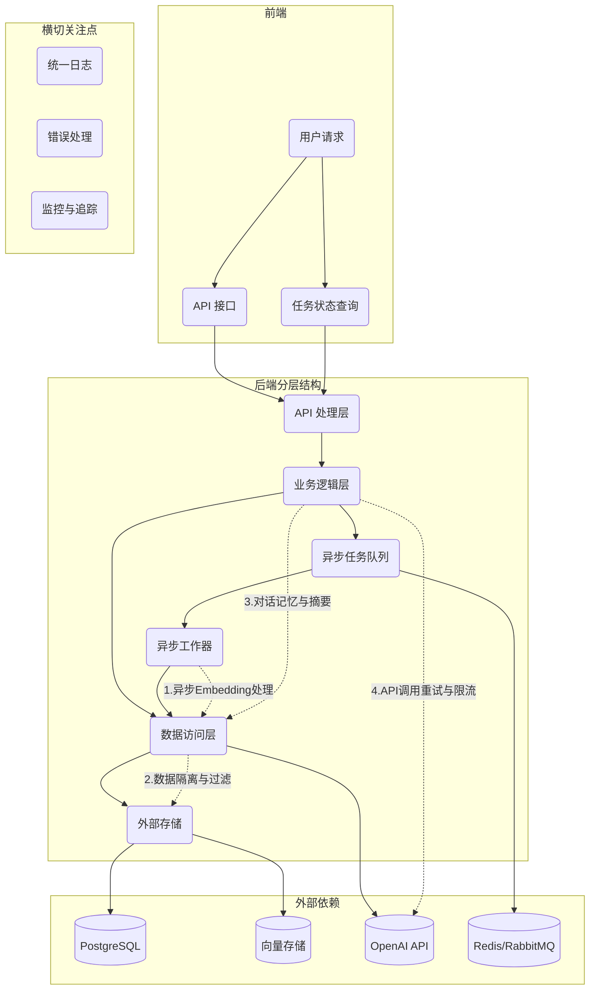
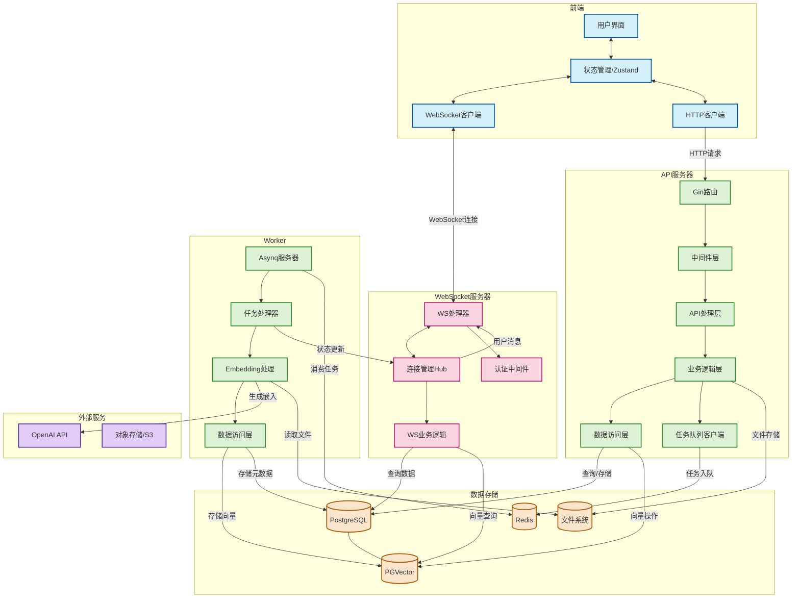
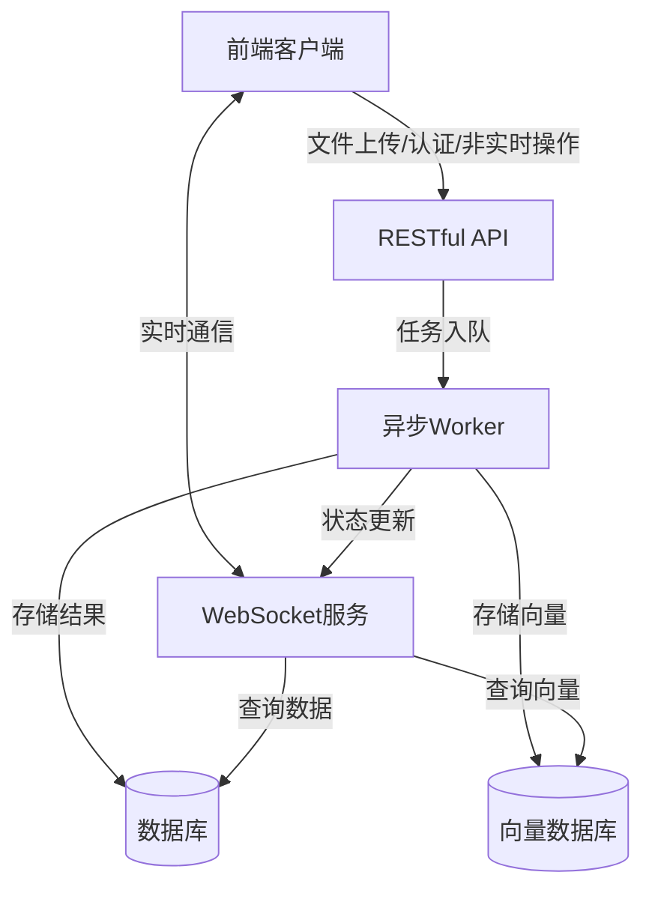

# DreamHub 架构与运维计划

## 1. 核心架构与近期改进

### 1.1 架构概览



### 1.2 基础分层与目录结构

保持 **Handler → Service → Repository** 的分层架构，具体实现以下目录结构：

```
dreamhub/
├── cmd/
│   └── server/
│       └── main.go            # 应用入口点、依赖注入
├── internal/
│   ├── api/                   # HTTP处理函数
│   │   ├── chat_handler.go
│   │   ├── upload_handler.go
│   │   └── task_handler.go    # 新增：任务状态查询
│   ├── service/               # 业务逻辑
│   │   ├── chat_service.go
│   │   ├── file_service.go
│   │   ├── memory_service.go  # 新增：对话记忆与摘要
│   │   ├── rag_service.go
│   │   └── embedder_service.go # 增强：加入重试机制
│   ├── repository/            # 数据访问接口
│   │   ├── chat_repo.go
│   │   ├── doc_repo.go
│   │   ├── vector_repo.go
│   │   └── task_repo.go       # 新增：任务状态存储
│   │   ├── postgres/          # PostgreSQL实现
│   │   │   └── chat_repo.go
│   │   └── pgvector/          # PGVector实现
│   │       └── doc_repo.go
│   ├── entity/                # 核心数据结构
│   │   ├── message.go
│   │   ├── document.go
│   │   └── task.go           # 新增：异步任务类型
│   └── worker/               # 异步处理
│       └── main.go           # 任务消费者
└── pkg/                      # 通用工具包
    ├── logger/               # 统一日志
    ├── apperr/               # 统一错误处理
    └── config/               # 配置管理
```

### 1.3 主要改进点 (近期实施)

#### 1.3.1 向量库元数据隔离（强制过滤）

- **问题**：当前向量检索不强制过滤用户/来源，存在跨租户数据泄露风险
- **方案**：
  - 在 `repository/pgvector/doc_repo.go` 中强制包含 `user_id` 和 `source_type` 过滤条件
  - 查询方法内部固定添加这些过滤参数，不依赖上层调用者传入
  - 在接口定义时使用 Context 传递用户信息 **(状态: 已在 Service 层向下传递带 user_id 的 Context)**
  - **增强**：在 `vector_repo.Insert()` / `Search()` 内部强制附加 `tenant_id`，接口签名干脆不暴露该字段 **(状态: 依赖 Repository 实现)**

#### 1.3.2 异步 Embedding 处理

- **问题**：上传大文档时，同步生成 Embedding 会导致请求超时
- **方案**：
  - 引入任务队列（Redis Stream、RabbitMQ 或 asynq 库）**(状态: 已使用 Asynq + Redis)**
  - 文件上传后立即返回 `task_id`，异步进行文档处理 **(状态: API 已实现)**
  - 增加 `/api/v1/tasks/{id}` 端点供前端轮询任务状态 **(状态: API 已实现)**
  - Worker 进程负责消费队列，处理 Embedding，更新任务状态 **(状态: Worker 核心逻辑已修复并可运行，但状态更新待完善)**
  - **增强**：
    - 在 `task_repo` 加入 `unique(file_hash)` 约束，确保任务幂等性 **(状态: 未实现)**
    - Worker 先查询任务状态，对于已完成的任务直接返回结果 **(状态: 未实现)**
    - 在 `task` 表增加 `priority`、`retry_count` 字段 **(状态: 未实现)**
    - 结合 Redis Stream 的 `XACK`+`XCLAIM` 实现任务限速和死信队列 **(状态: 未实现)**

#### 1.3.3 长对话记忆与摘要

- **问题**：当前只存储原始消息，缺乏长对话的总结和权重管理
- **方案**：
  - 新增 `memory_service.go` 负责生成对话摘要 **(状态: 接口已定义，实现未完成)**
  - 扩展数据库表，增加 `conversation_summary` 或相关字段 **(状态: 未实现)**
  - 实现对话历史的选择性检索、权重衰减等策略 **(状态: 未实现)**
  - **增强**：
    - 在 `memory_service` 中设计灵活接口：`Summarize(messages []Message) (summary string, err error)` **(状态: 接口已定义)**
    - 支持后期替换为不同的摘要算法（LLM、规则引擎或本地模型）

#### 1.3.4 统一错误与日志处理

- **问题**：缺乏结构化日志和统一错误处理
- **方案**：
  - 创建 `pkg/logger` 封装 slog 或 zap **(状态: 已实现并使用)**
  - 实现 `pkg/apperr` 定义带错误码的应用错误 **(状态: 已实现并使用)**
  - 添加 Gin 中间件，统一捕获并转换错误为 HTTP 响应 **(状态: 未检查/实现)**

#### 1.3.5 OpenAI 调用韧性增强

- **问题**：OpenAI 调用没有熔断、限速、重试机制
- **方案**：
  - 在 `embedder_service.go` 中加入指数退避重试 **(状态: 未实现)**
  - 集成速率限制器控制 API 请求频率 **(状态: 未实现)**
  - 支持多 API Key 轮换配置 **(状态: 未实现)**
  - **备注**: 已修复 `openai_provider.go` 和 `embedding_provider.go` 中的编译错误和 `langchaingo` API 调用问题。流式处理暂用非流式替代。

#### 1.3.6 数据一致性保障

- **问题**：向量写入成功但关系数据库操作失败可能导致数据不一致
- **方案**：
  - 在 service 层实现双阶段提交：先写 PostgreSQL 事务，commit 成功后再写向量库
  - 或采用 outbox pattern 防止分布式事务不一致
  - 关键操作添加事务边界，确保数据完整性

### 1.4 前后端通信架构 (混合API与WebSocket)

#### 1.4.1 通信需求分析

- **问题**：当前架构使用HTTP轮询获取任务状态和AI回复，存在以下问题：
 - 文件处理进度需要前端频繁轮询，增加服务器负载
 - AI回复无法实现流式返回，用户体验不佳
 - 未来多用户协作场景下缺乏实时通知机制
 - 实时编辑功能难以实现

- **方案**：采用混合架构，结合RESTful API和WebSocket的优势：
 - 保留RESTful API处理非实时操作（文件上传、认证授权等）
 - 引入WebSocket处理实时通信需求（进度通知、流式回复等）

#### 1.4.2 通信方案设计

##### 完整架构图



##### 简化通信流程图



#### 1.4.3 混合架构的优势

1.  **优化资源使用**：
    - HTTP连接用完即释放，适合短暂交互
    - WebSocket保持长连接，适合频繁实时通信

2.  **功能分离清晰**：
    - API处理数据操作和业务逻辑
    - WebSocket专注于实时通知和流式数据

3.  **渐进式实现**：
    - 可以保留现有API架构
    - 逐步添加WebSocket功能
    - 平滑过渡，降低重构风险

4.  **更好的错误处理**：
    - API可以返回标准HTTP状态码
    - WebSocket可以实现自定义心跳和重连机制

5.  **扩展性**：
    - 未来可以轻松添加更多实时功能
    - 支持服务端推送事件（SSE）作为备选方案

#### 1.4.4 实施路线图

1.  **第一阶段**：基础WebSocket支持
    - 实现WebSocket服务器和连接管理
    - 添加文件处理进度实时通知
    - 前端实现WebSocket连接和消息处理

2.  **第二阶段**：流式AI回复
    - 修改ChatService支持流式输出
    - 实现WebSocket消息类型和处理逻辑
    - 前端实现打字机效果显示

3.  **第三阶段**：多用户协作基础
    - 实现用户在线状态管理
    - 添加文件操作广播机制
    - 前端实现实时通知显示

4.  **第四阶段**：高级协作功能
    - 实现文档协同编辑
    - 添加用户光标位置同步
    - 实现操作冲突解决机制

#### 1.4.5 实现方案示例

##### WebSocket服务实现

```go
// 新增 WebSocket 处理器
type WSHandler struct {
   hub       *Hub
   upgrader  websocket.Upgrader
   authSvc   service.AuthService
}

// Hub 结构管理所有连接
type Hub struct {
   clients     map[*Client]bool
   userClients map[string][]*Client  // 按用户ID索引客户端
   register    chan *Client
   unregister  chan *Client
   broadcast   chan []byte
   userMsg     chan UserMessage
}

// 用户消息结构
type UserMessage struct {
   UserID  string
   Type    string  // "task_progress", "ai_stream", "collaboration"
   Payload []byte
}
```

##### Worker与WebSocket集成

```go
// 修改 EmbeddingTaskHandler 以支持进度通知
func (h *EmbeddingTaskHandler) ProcessTask(ctx context.Context, t *asynq.Task) error {
   // ... 现有代码 ...

   // 发送任务开始通知
   h.wsHub.SendToUser(payload.UserID, UserMessage{
       Type: "task_progress",
       Payload: json.Marshal(map[string]interface{}{
           "status": "started",
           "taskID": t.ResultWriter().TaskID(),
           "filename": payload.OriginalFilename,
       }),
   })

   // 处理过程中发送进度更新
   for i, chunk := range chunks {
       // 每处理10%的块发送一次进度
       if i % (len(chunks)/10) == 0 {
           progress := float64(i) / float64(len(chunks)) * 100
           h.wsHub.SendToUser(payload.UserID, UserMessage{
               Type: "task_progress",
               Payload: json.Marshal(map[string]interface{}{
                   "status": "processing",
                   "taskID": t.ResultWriter().TaskID(),
                   "progress": progress,
               }),
           })
       }
       // ... 处理块 ...
   }

   // ... 其余代码 ...
}
```

##### 流式AI回复实现

```go
// 修改 ChatService 以支持流式回复
func (s *chatServiceImpl) HandleStreamChatMessage(ctx context.Context, userID, conversationIDStr, message string, streamCh chan<- string) {
   // ... 前期处理与现有 HandleChatMessage 类似 ...

   // 使用流式API调用
   // 状态 (2025-04-26): 当前 GenerateContentStream 的实现是临时的，
   // 因为 langchaingo v0.1.13 中 openai.LLM 的流式选项 (llms.WithStreaming) 无效。
   // 需要进一步研究正确的流式 API (可能是独立的 Stream 方法或检查 GenerateContent 的响应)。
   // 暂时调用非流式方法。
   err := s.llm.GenerateContentStream(ctx, llmMessages, func(chunk string) {
   	// 将每个文本块发送到通道
   	streamCh <- chunk
   })

   // ... 错误处理 ...

   // 关闭通道表示完成
   close(streamCh)
}
```

### 1.5 生产就绪性收尾优化

在系统上线前，以下"收尾级"优化可以进一步提高系统的可靠性和稳定性：

#### 1.5.1 Context 透传规范

- **问题**：Handler→Service→Repo 全靠 `context.Context` 传递 `user_id/tenant_id/trace_id`，如果有一处忘了带 ctx，过滤就失效
- **方案**：
  - 在 linters 阶段加入 *staticcheck SA1027*（检测丢失 ctx）
  - 自建 `type CtxKey string`，统一 key 名
  - 全局封装 `GetUserID(ctx)`, `GetTenantID(ctx)` 等工具函数
  - 在 `pkg` 目录下创建 `ctxutil` 包，集中管理 context 相关操作

#### 1.5.2 向量库幂等插入

- **问题**：文件重复上传可能导致向量库中写入重复数据，浪费存储空间
- **方案**：
  - 在 `vector_repo.Insert()` 实现中先执行 `SELECT 1 WHERE chunk_hash=? AND tenant_id=?`，存在则跳过
  - 或在向量表中以 `(chunk_hash, tenant_id)` 建立唯一索引
  - 确保所有插入操作都是幂等的，重复执行不会产生副作用

#### 1.5.3 大文件分段事务

- **问题**：处理大文件（如 100MB PDF）可能生成上千个 chunk，若中途失败会导致数据部分写入
- **方案**：
  - Worker 分两阶段处理：
    1. 批量插入向量并记录到临时表 `doc_processing_tmp`
    2. 全部成功后执行 `UPDATE documents SET status=done` 并清理临时数据
  - 失败时可以幂等地重新执行整个过程
  - 考虑使用批处理，每批 N 个 chunk，减少单次事务大小

#### 1.5.4 队列爆仓保护

- **问题**：用户一次性提交大量文件可能导致队列深度激增，消耗过多内存
- **方案**：
  - 为每个租户设置 Redis Stream 限制：`XADD MAXLEN ~= 10k`
  - 超出限制时，将任务转入延迟队列或直接返回 429 状态码
  - 实现队列深度监控和告警机制
  - 考虑按租户设置不同的处理优先级

#### 1.5.5 LLM Key 旋转与额度告警

- **问题**：缺乏对 OpenAI API 使用情况的监控，可能导致突然达到限额或超出预算
- **方案**：
  - 在 `embedder_service` 中记录关键指标：`openai_req_total`、`quota_used_pct`
  - 配置 Alertmanager，当剩余额度低于 20% 时通过钉钉/Slack 发送告警
  - 实现 API Key 轮换机制，分散请求负载
  - 考虑实现按租户的使用量统计和限额控制

#### 1.5.6 灰度发布与回滚机制

- **问题**：Worker 新版本上线若处理逻辑有误，可能导致全量数据污染
- **方案**：
  - 为 `task` 和向量数据添加 `version` 字段
  - 新版本写入使用新的 namespace（如 `version = v2`）
  - 观察新版本运行 24 小时无问题后，将旧版本标记为只读
  - 出现问题时可以快速回滚到旧版本

## 2. CI/CD 流程 (GitHub Actions)

### 2.1 目标

为 DreamHub 项目创建一个 GitHub Actions CI/CD 流程，该流程在每次推送到 `main` 分支时触发，执行以下操作：

1.  运行 Go 后端和 React 前端的 Linting（可选但推荐）。
2.  运行 Go 后端和 React 前端（使用 Vitest）的测试。
3.  构建一个包含 Go server、Go worker 和 React 前端静态文件的 Docker 镜像，并使用 Supervisor 管理 Go 进程。
4.  将构建好的 Docker 镜像推送到 GitHub Container Registry (GHCR)。
5.  通过 SSH 连接到目标服务器，拉取最新的 Docker 镜像，并使用 `docker compose up -d`（假设服务器上已有 `docker-compose.yml`）重新部署应用。

### 2.2 准备工作 (需要在本地完成)

1.  **添加前端测试框架 (Vitest):**
    *   进入 `frontend` 目录: `cd frontend`
    *   安装 Vitest: `npm install --save-dev vitest @vitest/ui @testing-library/react @testing-library/jest-dom jsdom`
    *   配置 Vitest: 在 `frontend/vite.config.ts` 中添加 Vitest 配置，或者创建一个 `frontend/vitest.config.ts` 文件。
        ```typescript
        // Example vite.config.ts modification
        import { defineConfig } from 'vite'
        import react from '@vitejs/plugin-react'
        import type { UserConfig } from 'vitest/config' // Import UserConfig type

        // https://vitejs.dev/config/
        export default defineConfig({
          plugins: [react()],
          test: { // Add this test configuration
            globals: true,
            environment: 'jsdom',
            setupFiles: './src/setupTests.ts', // Optional setup file
            css: true,
          } as UserConfig['test'], // Cast to UserConfig['test']
        })
        ```
    *   (可选) 创建 `frontend/src/setupTests.ts` 文件用于测试设置。
    *   在 `frontend/package.json` 的 `scripts` 部分添加 `test` 脚本:
        ```json
        "scripts": {
          // ... other scripts
          "test": "vitest",
          "test:ui": "vitest --ui", // Optional for local UI testing
          "coverage": "vitest run --coverage" // Optional for coverage
        },
        ```
    *   编写前端测试用例。

2.  **创建 Dockerfile:**
    *   在项目根目录 (`f:/Download/DreamHub`) 创建 `Dockerfile` 文件。
        ```dockerfile
        # Stage 1: Build Go Backend (Server & Worker)
        FROM golang:1.22-alpine AS builder
        WORKDIR /app
        COPY go.mod go.sum ./
        RUN go mod download
        COPY . .
        # Build server
        RUN CGO_ENABLED=0 GOOS=linux go build -a -installsuffix cgo -o /server cmd/server/main.go
        # Build worker
        RUN CGO_ENABLED=0 GOOS=linux go build -a -installsuffix cgo -o /worker cmd/worker/main.go

        # Stage 2: Build Frontend
        FROM node:20-alpine AS frontend-builder
        WORKDIR /app/frontend
        COPY frontend/package.json frontend/package-lock.json* ./
        # Use ci for potentially faster and more reliable installs in CI
        RUN npm ci
        COPY frontend/ ./
        # Add build-time args if needed, e.g., ARG VITE_API_URL
        # RUN npm run build -- --base=./ --mode production -- VITE_API_URL=$VITE_API_URL
        RUN npm run build

        # Stage 3: Final Image
        FROM alpine:latest
        # Install supervisor and any other runtime dependencies
        RUN apk update && apk add --no-cache supervisor ca-certificates tzdata && rm -rf /var/cache/apk/*
        WORKDIR /app
        # Copy Go binaries from builder stage
        COPY --from=builder /server /app/server
        COPY --from=builder /worker /app/worker
        # Copy frontend build from frontend-builder stage
        # Assuming the server serves frontend files from a 'public' or 'static' directory
        COPY --from=frontend-builder /app/frontend/dist /app/frontend/dist
        # Copy supervisor config
        COPY supervisord.conf /etc/supervisor/conf.d/supervisord.conf
        # Copy .env.example for reference, but actual .env should be mounted or managed externally on the server
        # COPY .env.example .env.example

        # Expose the port the server listens on (adjust if needed)
        EXPOSE 8080

        # Set the entrypoint to supervisor
        ENTRYPOINT ["/usr/bin/supervisord", "-c", "/etc/supervisor/conf.d/supervisord.conf"]
        # CMD is defined in supervisord.conf
        ```

3.  **创建 Supervisor 配置:**
    *   在项目根目录创建 `supervisord.conf` 文件，用于管理 server 和 worker 进程：
        ```ini
        [supervisord]
        nodaemon=true ; Run in foreground for Docker

        [program:server]
        command=/app/server
        autostart=true
        autorestart=true
        stderr_logfile=/dev/stderr
        stderr_logfile_maxbytes=0
        stdout_logfile=/dev/stdout
        stdout_logfile_maxbytes=0
        # Add environment variables if needed directly here, or manage via .env file mount
        # environment=VAR1="value1",VAR2="value2"

        [program:worker]
        command=/app/worker
        autostart=true
        autorestart=true
        stderr_logfile=/dev/stderr
        stderr_logfile_maxbytes=0
        stdout_logfile=/dev/stdout
        stdout_logfile_maxbytes=0
        # environment=VAR1="value1",VAR2="value2"
        ```

4.  **创建 `.dockerignore`:**
    *   在项目根目录创建 `.dockerignore` 文件，排除不需要复制到 Docker 镜像中的文件/目录：
        ```
        .git
        .vscode
        frontend/node_modules
        uploads/*
        *.md
        # Add other files/dirs to ignore
        ```

5.  **(可选) 创建 `docker-compose.yml`:**
    *   在项目根目录创建 `docker-compose.yml`，方便本地测试和服务器部署。这个文件应该与服务器上的文件保持一致或作为其基础。
        ```yaml
        version: '3.8'

        services:
          app:
            image: your-local-image-name:latest # Use local name for testing
            # build: . # Uncomment to build locally
            restart: always
            ports:
              - "8080:8080" # Map host port to container port
            env_file:
              - .env # Mount the .env file from the host
            volumes:
              - ./uploads:/app/uploads # Mount uploads directory if needed
            # Add dependencies like database if needed
            # depends_on:
            #   - db

        # Example database service (if needed)
        # db:
        #   image: postgres:15-alpine
        #   restart: always
        #   environment:
        #     POSTGRES_USER: ${DB_USER}
        #     POSTGRES_PASSWORD: ${DB_PASSWORD}
        #     POSTGRES_DB: ${DB_NAME}
        #   volumes:
        #     - postgres_data:/var/lib/postgresql/data
        #     - ./init_db.sql:/docker-entrypoint-initdb.d/init.sql # Optional init script
        #   ports:
        #     - "5432:5432"

        # volumes:
        #   postgres_data:
        ```

### 2.3 GitHub Actions Workflow (`.github/workflows/ci-cd.yml`)

```yaml
name: DreamHub CI/CD

on:
  push:
    branches: [ main ]
  workflow_dispatch: # Allows manual triggering

jobs:
  lint:
    runs-on: ubuntu-latest
    steps:
      - name: Checkout code
        uses: actions/checkout@v4

      - name: Set up Go
        uses: actions/setup-go@v5
        with:
          go-version: '1.22' # Match your project's Go version

      - name: Run Go Lint # Replace with your preferred linter, e.g., golangci-lint
        run: go vet ./... # Example, use golangci-lint run ./... if configured

      - name: Set up Node.js
        uses: actions/setup-node@v4
        with:
          node-version: '20' # Match your project's Node version
          cache: 'npm'
          cache-dependency-path: frontend/package-lock.json

      - name: Install Frontend Dependencies
        run: npm ci --prefix frontend

      - name: Run Frontend Lint
        run: npm run lint --prefix frontend

  test:
    runs-on: ubuntu-latest
    needs: lint # Optional: Run tests only if lint passes
    steps:
      - name: Checkout code
        uses: actions/checkout@v4

      - name: Set up Go
        uses: actions/setup-go@v5
        with:
          go-version: '1.22'

      - name: Run Go Tests
        run: go test -v ./... # Add coverage flags if needed, e.g., -coverprofile=coverage.out

      # Optional: Upload Go coverage report
      # - name: Upload Go coverage to Codecov
      #   uses: codecov/codecov-action@v4
      #   with:
      #     token: ${{ secrets.CODECOV_TOKEN }} # Store Codecov token in secrets
      #     files: ./coverage.out
      #     flags: go

      - name: Set up Node.js
        uses: actions/setup-node@v4
        with:
          node-version: '20'
          cache: 'npm'
          cache-dependency-path: frontend/package-lock.json

      - name: Install Frontend Dependencies
        run: npm ci --prefix frontend

      - name: Run Frontend Tests (Vitest)
        run: npm test -- --run --coverage --prefix frontend # Use --run for non-watch mode in CI

      # Optional: Upload Vitest coverage report
      # - name: Upload Vitest coverage to Codecov
      #   uses: codecov/codecov-action@v4
      #   with:
      #     token: ${{ secrets.CODECOV_TOKEN }}
      #     flags: frontend # Flag to distinguish coverage reports
      #     working-directory: ./frontend # Specify working directory for coverage file search

  build_and_push_image:
    runs-on: ubuntu-latest
    needs: test # Run build only if tests pass
    permissions:
      contents: read
      packages: write # Needed to push to GHCR
    steps:
      - name: Checkout code
        uses: actions/checkout@v4

      - name: Set up Docker Buildx
        uses: docker/setup-buildx-action@v3

      - name: Log in to GitHub Container Registry
        uses: docker/login-action@v3
        with:
          registry: ghcr.io
          username: ${{ github.actor }}
          password: ${{ secrets.GITHUB_TOKEN }} # Use the default GITHUB_TOKEN

      - name: Build and push Docker image
        uses: docker/build-push-action@v6
        with:
          context: .
          file: ./Dockerfile
          push: true
          tags: |
            ghcr.io/${{ github.repository_owner }}/dreamhub:latest
            ghcr.io/${{ github.repository_owner }}/dreamhub:${{ github.sha }}
          cache-from: type=gha
          cache-to: type=gha,mode=max
          # Add build args if needed, getting values from secrets
          # build-args: |
          #   VITE_API_URL=${{ secrets.VITE_API_URL }}

  deploy:
    runs-on: ubuntu-latest
    needs: build_and_push_image # Run deploy only after image is pushed
    environment: production # Optional: Define a GitHub environment for deployment secrets/rules
    steps:
      - name: Deploy to Server via SSH
        uses: appleboy/ssh-action@v1.0.3
        with:
          host: ${{ secrets.SSH_HOST }} # Server IP or hostname
          username: ${{ secrets.SSH_USER }} # SSH username
          key: ${{ secrets.SSH_PRIVATE_KEY }} # SSH private key
          port: ${{ secrets.SSH_PORT || 22 }} # SSH port (default 22)
          script: |
            cd /path/to/app # CHANGE THIS to the actual path on your server
            echo "Pulling latest image..."
            docker pull ghcr.io/${{ github.repository_owner }}/dreamhub:latest
            echo "Stopping and removing old container (if using docker run)..."
            # docker stop dreamhub_app || true # Adjust container name if needed
            # docker rm dreamhub_app || true
            echo "Starting new container with docker compose..."
            # Ensure docker-compose.yml exists in /path/to/app on the server
            # Make sure the image name in docker-compose.yml is ghcr.io/${{ github.repository_owner }}/dreamhub:latest
            docker compose up -d --remove-orphans # Use --remove-orphans to clean up old services if compose file changes
            echo "Deployment complete!"
            # Optional: Prune old images
            # docker image prune -f

```

### 2.4 GitHub Secrets 配置

你需要在你的 GitHub 仓库的 `Settings > Secrets and variables > Actions` 中配置以下 Secrets：

*   `SSH_HOST`: 你的部署服务器的 IP 地址或域名。
*   `SSH_USER`: 用于 SSH 连接的用户名。
*   `SSH_PRIVATE_KEY`: 用于 SSH 连接的私钥内容。**确保私钥格式正确，并且没有密码保护，或者在 CI 中处理密码。**
*   `SSH_PORT`: (可选) SSH 端口，如果不是默认的 22。
*   (如果需要构建时参数) `VITE_API_URL`: 前端构建时需要的 API 地址。
*   (如果需要上传覆盖率) `CODECOV_TOKEN`: Codecov 的上传令牌。

### 2.5 Mermaid 流程图

```mermaid
graph TD
    A[Push to main] --> B{Run CI/CD Workflow};
    B --> C[Lint Job];
    C --> D[Test Job];
    D --> E[Build & Push Image Job];
    E --> F[Deploy Job];

    subgraph Lint Job
        C1[Checkout Code] --> C2[Setup Go];
        C2 --> C3[Run Go Lint];
        C3 --> C4[Setup Node.js];
        C4 --> C5[Install Frontend Deps];
        C5 --> C6[Run Frontend Lint];
    end

    subgraph Test Job
        D1[Checkout Code] --> D2[Setup Go];
        D2 --> D3[Run Go Tests];
        D3 --> D4[Setup Node.js];
        D4 --> D5[Install Frontend Deps];
        D5 --> D6[Run Frontend Tests];
        D3 --> D7[Upload Go Coverage (Optional)];
        D6 --> D8[Upload Frontend Coverage (Optional)];
    end

    subgraph Build & Push Image Job
        E1[Checkout Code] --> E2[Setup Docker Buildx];
        E2 --> E3[Login to GHCR];
        E3 --> E4[Build Docker Image];
        E4 --> E5[Push Image to GHCR];
    end

    subgraph Deploy Job
        F1[Configure SSH] --> F2[Connect to Server];
        F2 --> F3[Pull Latest Image];
        F3 --> F4[Run docker compose up -d];
        F4 --> F5[Deployment Complete];
    end
```

## 3. 生产运维与就绪检查

### 3.1 生产环境就绪检查清单

在系统正式上线前，以下检查清单可以确保系统达到"金融 SaaS 级上线水准"：

#### 3.1.1 安全

- [ ] **Secrets 管理**
  - 使用 Vault / AWS Secrets Manager / Doppler / SOPS 管理所有敏感信息
  - OpenAI Key、数据库密码、JWT Secret 等绝不直接写入环境变量或 Helm values
  - 实现密钥定期轮换机制

- [ ] **上传文件安全**
  - 实现 MIME 类型白名单过滤
  - 集成 ClamAV 进行病毒/木马扫描
  - 对可执行压缩包直接拒绝处理
  - 考虑使用 ClamAV DaemonSidecar 在 Kubernetes 中部署

#### 3.1.2 网络与灰度发布

- [ ] **流量镜像**
  - 新版本上线前，将 5% 的请求镜像到新 Worker 进行对比测试
  - 使用 Istio / Envoy 实现流量镜像功能
  - 分析新旧版本的处理结果差异

- [ ] **蓝绿或 Canary 部署**
  - 配置 Kubernetes Deployment: `maxSurge=1`, `maxUnavailable=0`
  - 确保回滚时间 < 1 分钟
  - 考虑使用 Argo Rollouts 实现更复杂的部署策略

#### 3.1.3 数据管理

- [ ] **数据库版本升级策略**
  - 确认 PGVector 版本 ≥ 15
  - 验证生产环境和测试环境数据库版本一致
  - 制定 pg_upgrade 方案

- [ ] **备份/恢复演练**
  - 实现向量表和业务表的全量备份
  - 验证能否在 30 分钟内完成恢复
  - 使用 pg_dump + pg_restore 并设置 cron 任务定期备份

#### 3.1.4 性能优化

- [ ] **批量插入优化**
  - Worker 插入向量时使用 `COPY ... FROM STDIN` 或 pgvector batch API
  - 避免单条 INSERT 操作（TPS < 1k 会严重影响性能）
  - 使用 pgx CopyFrom 功能实现高效批量插入

- [ ] **pgvector 索引优化**
  - 确认 `ivfflat` 索引已执行 `ANALYZE`
  - 设置 VACUUM 周期性执行脚本
  - 调整 autovacuum 参数以适应工作负载

#### 3.1.5 监控与告警

- [ ] **"软死锁"检测**
  - 监控队列深度、Worker 并发数、OpenAI 调用速率与处理延迟的关系
  - 配置 Prometheus 告警: `queue_depth / workers_busy > 500`
  - 使用 PromQL + Alertmanager 实现自动告警

- [ ] **成本监控面板**
  - 每日推送各租户的 token 使用量、磁盘占用、Redis 内存使用情况
  - 使用 Grafana JSON 导出到 Slack
  - 避免月底突然超出预算

#### 3.1.6 开发体验与 CI

- [ ] **pre-commit hooks**
  - 配置 `go vet`, `staticcheck`, `golangci-lint`, `mermaid-lint`
  - 使用 pre-commit 框架管理 Git hooks
  - 确保代码质量在提交前就得到检查

- [ ] **端到端测试**
  - 使用 Kind 启动完整测试栈
  - 执行 `upload→task→search→chat` 全流程测试
  - 与预期输出（golden output）进行比对
  - 使用 Go test + curl 实现自动化测试

#### 3.1.7 合规性

- [ ] **GDPR/PDPA 合规**
  - 支持"用户数据删除请求"
  - 实现触发向量数据、文档数据和对话历史在 72 小时内完全删除的机制
  - 使用后台任务处理删除请求

### 3.2 上线前最后检查清单

以下是上线前的最后检查清单，帮助在真正部署前再把风险降到最低：

| 类别            | 关注点                                          | 实践调整建议                                                                                      |
|---------------|----------------------------------------------|----------------------------------------------------------------------------------------------|
| **Secrets 管理**      | Worker 如何在 Key 轮换后拿到最新凭证？                      | 增加一个 sidecar（如 `hashicorp/vault-agent` 或 AWS SDK IMDS），写入短期令牌到 tmpfs，主进程收到 SIGHUP 时重新加载，无需重启。 |
| **Schema 漂移**      | PG migration 和 pgvector 索引要在 Worker 启动前完成       | 用 k8s `initJob`（如 `golang-migrate/migrate`）做 DB 初始化；Worker 加一个 `postStart` 探针，轮询 `pg_tables` 确认 `vectors` 表已就绪。 |
| **Embedding 成本激增** | 用户上传 500 页 PDF 时，瞬间消耗大量 Token                   | 在 `embedder_service` 中先做粗略长度估算：若超阈值，先入队"切分 & 压缩"任务（PDF→文本→LangChain `RecursiveCharacterTextSplitter`），并在 UI 显示预计成本让用户确认。 |
| **背压与反馈**       | 队列堆积 + OpenAI 慢 → SLA 违约                            | 添加"优先级重排"：当 `embedding_latency_p95 > X` 时，将非紧急任务降级到冷流（cold stream），待空闲再升级处理。            |
| **模型版本漂移**     | GPT-4o vs GPT-4-1106 等模型行为会悄然变化                    | 在日志和 DB 中保存每次 API 调用的 `model` 字段，方便回放和调试时重现当时使用的模型与 Prompt。                       |
| **镜像来源可信**     | 供应链安全越来越严格，必须发布经过签名的镜像                     | 在 CI/CD 中加入 `anchore/sbom-action` 生成 SBOM，并用 `cosign sign --key cosign.key` 签名；集群启动前用 `cosign verify` 验证。 |
| **快速失败体验**     | `/tasks/{id}` 一直轮询，Worker 崩了就卡死                         | 返回带指数退避的 `Retry-After` 提示头，在 UI 展示部分进度（如已处理页数），可从 `doc_processing_tmp` 读出断点进度。 |
| **端到端删除**      | GDPR 删除必须触及：向量、文件、Redis、S3 备份                    | 写一个 "eraser" 任务，接收 `delete_request_id` 后并行并发四个 Goroutine（PG、向量库、S3、Redis），全部成功后发 Webhook；并写集成测试断言彻底清除。 |
| **Chaos 演练**     | 只有自己打破系统一次，才会真正放心                              | 使用 `chaos-mesh` 或 `litmuschaos`：1) 随机杀 50% Worker；2) 注入 PG 延迟 2s；3) 拦截 OpenAI 流量 30s。系统要自动重试，不丢数据。  |

### 3.3 开发者自留脚本

以下是两个上线后会感谢自己的开发者自留脚本：

1.  **`make dev-up`**

    ```bash
    docker compose --profile dev up -d --build
    go run ./cmd/server &
    go run ./cmd/worker &
    cosign verify ghcr.io/你/仓库/server:latest
    ```
    一条命令，完整栈起起来，镜像自动校验。

2.  **`scripts/post-merge.sh`**

    ```bash
    #!/usr/bin/env bash
    set -e
    pre-commit run --all-files
    make lint && make test
    docker build -f Dockerfile.server -t dreamhub/server:local .
    ```
    每次 `git pull` 后自动跑，保证本地环境始终绿灯。

### 3.4 上线绿灯指标

当 **`openai_error_rate < 1% 且 queue_wait_p95 < 2 × ingest_time`** 在 Staging 环境持续 72 小时，并且所有告警静默，方可切流量到生产。

## 4. 未来规划与可选增强

### 4.1 可选增强点

1.  **事件总线**：引入领域事件（如 `FileUploaded`），解耦上传与处理
2.  **缓存层**：高频对话检索结果和热点文档块使用 Redis 缓存
3.  **插件架构**：扩展 RAG 能力，支持网络检索、日历访问等
4.  **多租户隔离**：
   - PostgreSQL 开启 Row-Level Security
   - 向量库按 `namespace = tenantID` 分片
   - 所有上传文件先落磁盘临时目录并做 MIME 校验，防病毒/木马
5.  **CI/CD 与测试**：
   - GitHub Actions 流程：
     1. go test
     2. go vet/linters
     3. docker-build
     4. kind + integration test（起本地 PG + PGVector + Redis）
     5. 推镜像
6.  **回滚策略**：
   - worker 版本升级要兼容旧队列格式
   - 考虑给 `task` 添加 `version` 字段或使用 protobuf/JSON schema

### 4.2 长期规划项

以下是可以在系统稳定运行后考虑的长期优化方向：

#### 4.2.1 插件化 RAG

- 在 `memory_service` 中预留 `SourceProvider` 接口
- 实现多种数据源适配器：`FromWebCrawler`、`FromEmail`、`FromCalendar` 等
- 使用策略模式动态选择和组合不同的数据源
- 新增数据源时无需修改主流程代码

#### 4.2.2 增量微调（Fine-Tuning）流水线

- 当对话与文档量达到一定规模后，从 `conversation_summary` 和高评分回答中提取训练数据
- 定期将数据转换为 JSONL 格式，触发模型微调任务
- 使自有模型逐渐适应特定领域的语料，减少 RAG 成本
- 建立模型评估机制，确保微调后的模型性能提升

### 4.3 可视化增强

以下可视化功能可以在系统上线后快速实现，提升用户体验和运营效率：

#### 4.3.1 实时任务监控面板

- X 轴表示时间，Y 轴表示不同状态任务计数（queued/running/succeeded/failed）
- 当失败率超过 5% 时自动高亮显示
- 支持点击条形图跳转到相应的任务日志
- 可以使用 Grafana + Prometheus 实现

#### 4.3.2 知识库增长热力图

- 横轴表示日期，纵轴表示租户
- 颜色深浅代表向量数据增量大小
- 可以一目了然地看出哪些客户活跃度最高
- 为销售团队提供 upsell 的数据支持
- 可以使用 Grafana 或自定义 D3.js 可视化实现

## 5. 总结

架构的核心框架（**Handler → Service → Repository**）是合理的，我们主要通过以上改进解决：

1.  **异步处理** - 提升响应速度和稳定性
2.  **数据隔离** - 增强安全性
3.  **对话管理** - 改进用户体验
4.  **系统韧性** - 应对外部依赖不稳定
5.  **可观测性** - 方便排查问题
6.  **数据一致性** - 确保系统状态完整
7.  **任务幂等性** - 防止重复处理

这些改进将使系统从原型阶段向可靠的生产环境迈进。如果计划未来 SaaS 化，多租户隔离（RLS/namespace）应当在早期就确定好，避免后期迁移的复杂性。

通过实施上述计划，DreamHub 项目将获得以下优势：

1.  **开发效率提升** - CI/CD 流程自动化减少手动操作，提高开发效率
2.  **环境一致性** - Docker 容器确保开发、测试和生产环境的一致性
3.  **质量保障** - 自动化测试和代码检查提早发现问题
4.  **部署可靠性** - 标准化的部署流程减少人为错误
5.  **协作基础** - 为未来团队协作打下坚实基础
6.  **可观测性** - 完善的监控和日志系统便于问题排查

特别是对于 DreamHub 这样的项目，CI/CD 流程的建立将使其从功能开发阶段平稳过渡到一个可靠、可扩展的生产系统。通过 GitHub Actions 和 Docker 容器化技术，我们可以在保持低成本的同时，获得企业级的开发和部署体验。

随着项目的发展和团队的扩大，这套 CI/CD 流程可以进一步扩展，支持更复杂的部署策略（如蓝绿部署、金丝雀发布）和更全面的测试覆盖。
