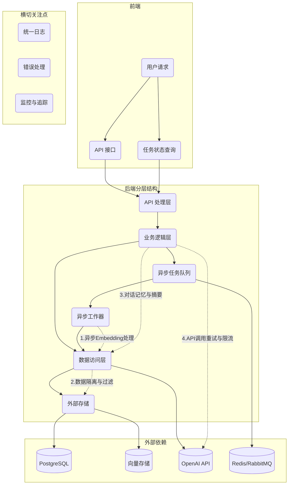
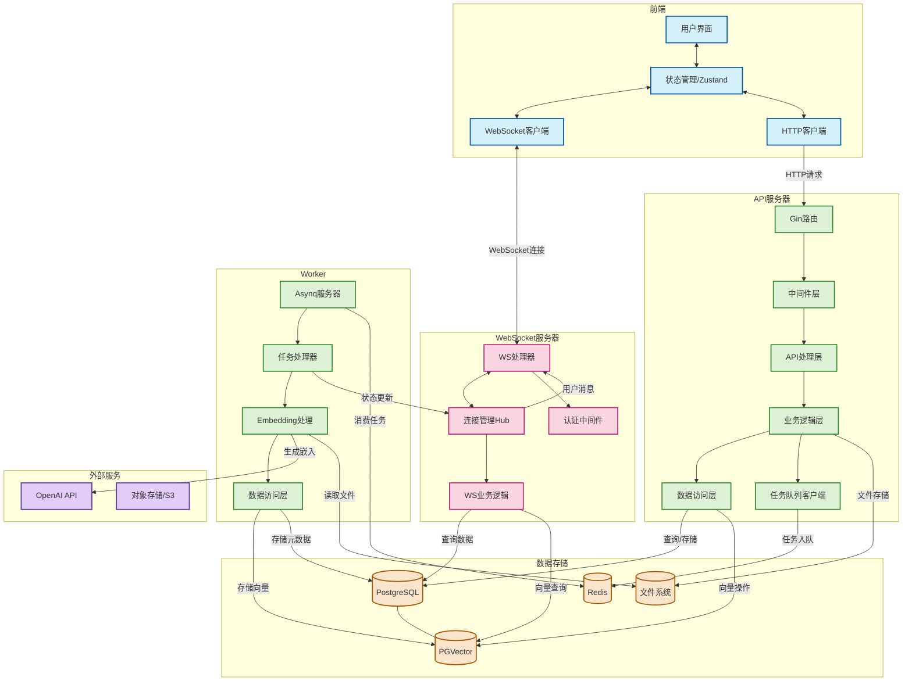
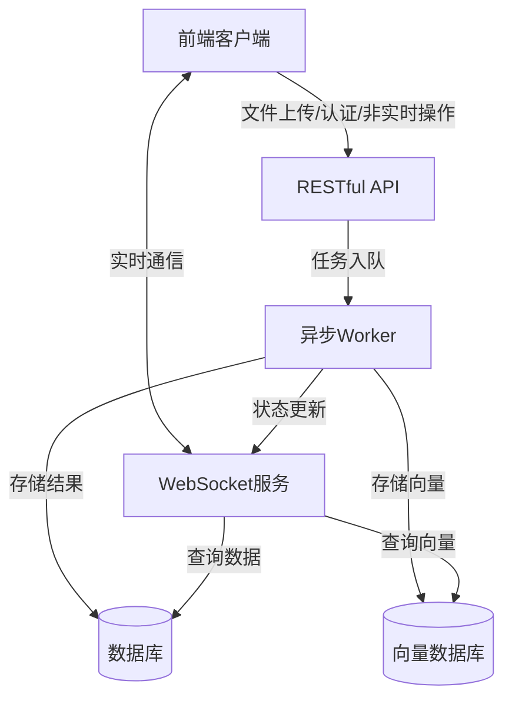
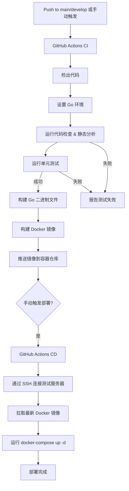

# DreamHub 架构改进计划

## 架构概览



## 1. 基础分层结构

保持 **Handler → Service → Repository** 的分层架构，具体实现以下目录结构：

```
dreamhub/
├── cmd/
│   └── server/
│       └── main.go            # 应用入口点、依赖注入
├── internal/
│   ├── api/                   # HTTP处理函数
│   │   ├── chat_handler.go
│   │   ├── upload_handler.go
│   │   └── task_handler.go    # 新增：任务状态查询
│   ├── service/               # 业务逻辑
│   │   ├── chat_service.go
│   │   ├── file_service.go
│   │   ├── memory_service.go  # 新增：对话记忆与摘要
│   │   ├── rag_service.go
│   │   └── embedder_service.go # 增强：加入重试机制
│   ├── repository/            # 数据访问接口
│   │   ├── chat_repo.go
│   │   ├── doc_repo.go
│   │   ├── vector_repo.go
│   │   └── task_repo.go       # 新增：任务状态存储
│   │   ├── postgres/          # PostgreSQL实现
│   │   │   └── chat_repo.go
│   │   └── pgvector/          # PGVector实现
│   │       └── doc_repo.go
│   ├── entity/                # 核心数据结构
│   │   ├── message.go
│   │   ├── document.go
│   │   └── task.go           # 新增：异步任务类型
│   └── worker/               # 异步处理
│       └── main.go           # 任务消费者
└── pkg/                      # 通用工具包
    ├── logger/               # 统一日志
    ├── apperr/               # 统一错误处理
    └── config/               # 配置管理
```

## 2. 主要改进点（按优先级）

### 2.1 向量库元数据隔离（强制过滤）

- **问题**：当前向量检索不强制过滤用户/来源，存在跨租户数据泄露风险
- **方案**：
  - 在 `repository/pgvector/doc_repo.go` 中强制包含 `user_id` 和 `source_type` 过滤条件
  - 查询方法内部固定添加这些过滤参数，不依赖上层调用者传入
  - 在接口定义时使用 Context 传递用户信息
  - **增强**：在 `vector_repo.Insert()` / `Search()` 内部强制附加 `tenant_id`，接口签名干脆不暴露该字段

### 2.2 异步 Embedding 处理

- **问题**：上传大文档时，同步生成 Embedding 会导致请求超时
- **方案**：
  - 引入任务队列（Redis Stream、RabbitMQ 或 asynq 库）
  - 文件上传后立即返回 `task_id`，异步进行文档处理
  - 增加 `/api/v1/tasks/{id}` 端点供前端轮询任务状态
  - Worker 进程负责消费队列，处理 Embedding，更新任务状态
  - **增强**：
    - 在 `task_repo` 加入 `unique(file_hash)` 约束，确保任务幂等性
    - Worker 先查询任务状态，对于已完成的任务直接返回结果
    - 在 `task` 表增加 `priority`、`retry_count` 字段
    - 结合 Redis Stream 的 `XACK`+`XCLAIM` 实现任务限速和死信队列

### 2.3 长对话记忆与摘要

- **问题**：当前只存储原始消息，缺乏长对话的总结和权重管理
- **方案**：
  - 新增 `memory_service.go` 负责生成对话摘要
  - 扩展数据库表，增加 `conversation_summary` 或相关字段
  - 实现对话历史的选择性检索、权重衰减等策略
  - **增强**：
    - 在 `memory_service` 中设计灵活接口：`Summarize(messages []Message) (summary string, err error)`
    - 支持后期替换为不同的摘要算法（LLM、规则引擎或本地模型）

### 2.4 统一错误与日志处理

- **问题**：缺乏结构化日志和统一错误处理
- **方案**：
  - 创建 `pkg/logger` 封装 slog 或 zap
  - 实现 `pkg/apperr` 定义带错误码的应用错误
  - 添加 Gin 中间件，统一捕获并转换错误为 HTTP 响应

### 2.5 OpenAI 调用韧性增强

- **问题**：OpenAI 调用没有熔断、限速、重试机制
- **方案**：
  - 在 `embedder_service.go` 中加入指数退避重试
  - 集成速率限制器控制 API 请求频率
  - 支持多 API Key 轮换配置

### 2.6 数据一致性保障

- **问题**：向量写入成功但关系数据库操作失败可能导致数据不一致
- **方案**：
  - 在 service 层实现双阶段提交：先写 PostgreSQL 事务，commit 成功后再写向量库
  - 或采用 outbox pattern 防止分布式事务不一致
  - 关键操作添加事务边界，确保数据完整性

### 2.7 监控与追踪（建议但非必需）

- **问题**：缺乏性能监控和问题排查工具
- **方案**：
  - 集成 OpenTelemetry + Prometheus Exporter
  - 关键指标：`queue_length`、`embedding_seconds`、`search_latency_ms`、`openai_error_rate`
  - 在 Gin 中间件、worker 消费逻辑插入 `trace.Context`，输出到 Jaeger/Loki
  - 设置关键指标的报警阈值

## 3. 未来可选增强点

1. **事件总线**：引入领域事件（如 `FileUploaded`），解耦上传与处理
2. **缓存层**：高频对话检索结果和热点文档块使用 Redis 缓存
3. **插件架构**：扩展 RAG 能力，支持网络检索、日历访问等
4. **多租户隔离**：
   - PostgreSQL 开启 Row-Level Security
   - 向量库按 `namespace = tenantID` 分片
   - 所有上传文件先落磁盘临时目录并做 MIME 校验，防病毒/木马
5. **CI/CD 与测试**：
   - GitHub Actions 流程：
     1. go test
     2. go vet/linters
     3. docker-build
     4. kind + integration test（起本地 PG + PGVector + Redis）
     5. 推镜像
6. **回滚策略**：
   - worker 版本升级要兼容旧队列格式
   - 考虑给 `task` 添加 `version` 字段或使用 protobuf/JSON schema

## 3.5 前后端通信架构：混合API与WebSocket

### 3.5.1 通信需求分析

- **问题**：当前架构使用HTTP轮询获取任务状态和AI回复，存在以下问题：
 - 文件处理进度需要前端频繁轮询，增加服务器负载
 - AI回复无法实现流式返回，用户体验不佳
 - 未来多用户协作场景下缺乏实时通知机制
 - 实时编辑功能难以实现

- **方案**：采用混合架构，结合RESTful API和WebSocket的优势：
 - 保留RESTful API处理非实时操作（文件上传、认证授权等）
 - 引入WebSocket处理实时通信需求（进度通知、流式回复等）

### 3.5.2 通信方案设计

#### 完整架构图



#### 简化通信流程图



### 3.5.3 混合架构的优势

1. **优化资源使用**：
  - HTTP连接用完即释放，适合短暂交互
  - WebSocket保持长连接，适合频繁实时通信

2. **功能分离清晰**：
  - API处理数据操作和业务逻辑
  - WebSocket专注于实时通知和流式数据

3. **渐进式实现**：
  - 可以保留现有API架构
  - 逐步添加WebSocket功能
  - 平滑过渡，降低重构风险

4. **更好的错误处理**：
  - API可以返回标准HTTP状态码
  - WebSocket可以实现自定义心跳和重连机制

5. **扩展性**：
  - 未来可以轻松添加更多实时功能
  - 支持服务端推送事件（SSE）作为备选方案

### 3.5.4 实施路线图

1. **第一阶段**：基础WebSocket支持
  - 实现WebSocket服务器和连接管理
  - 添加文件处理进度实时通知
  - 前端实现WebSocket连接和消息处理

2. **第二阶段**：流式AI回复
  - 修改ChatService支持流式输出
  - 实现WebSocket消息类型和处理逻辑
  - 前端实现打字机效果显示

3. **第三阶段**：多用户协作基础
  - 实现用户在线状态管理
  - 添加文件操作广播机制
  - 前端实现实时通知显示

4. **第四阶段**：高级协作功能
  - 实现文档协同编辑
  - 添加用户光标位置同步
  - 实现操作冲突解决机制

### 3.5.5 实现方案示例

#### WebSocket服务实现

```go
// 新增 WebSocket 处理器
type WSHandler struct {
   hub       *Hub
   upgrader  websocket.Upgrader
   authSvc   service.AuthService
}

// Hub 结构管理所有连接
type Hub struct {
   clients     map[*Client]bool
   userClients map[string][]*Client  // 按用户ID索引客户端
   register    chan *Client
   unregister  chan *Client
   broadcast   chan []byte
   userMsg     chan UserMessage
}

// 用户消息结构
type UserMessage struct {
   UserID  string
   Type    string  // "task_progress", "ai_stream", "collaboration"
   Payload []byte
}
```

#### Worker与WebSocket集成

```go
// 修改 EmbeddingTaskHandler 以支持进度通知
func (h *EmbeddingTaskHandler) ProcessTask(ctx context.Context, t *asynq.Task) error {
   // ... 现有代码 ...
   
   // 发送任务开始通知
   h.wsHub.SendToUser(payload.UserID, UserMessage{
       Type: "task_progress",
       Payload: json.Marshal(map[string]interface{}{
           "status": "started",
           "taskID": t.ResultWriter().TaskID(),
           "filename": payload.OriginalFilename,
       }),
   })
   
   // 处理过程中发送进度更新
   for i, chunk := range chunks {
       // 每处理10%的块发送一次进度
       if i % (len(chunks)/10) == 0 {
           progress := float64(i) / float64(len(chunks)) * 100
           h.wsHub.SendToUser(payload.UserID, UserMessage{
               Type: "task_progress",
               Payload: json.Marshal(map[string]interface{}{
                   "status": "processing",
                   "taskID": t.ResultWriter().TaskID(),
                   "progress": progress,
               }),
           })
       }
       // ... 处理块 ...
   }
   
   // ... 其余代码 ...
}
```

#### 流式AI回复实现

```go
// 修改 ChatService 以支持流式回复
func (s *chatServiceImpl) HandleStreamChatMessage(ctx context.Context, userID, conversationIDStr, message string, streamCh chan<- string) {
   // ... 前期处理与现有 HandleChatMessage 类似 ...
   
   // 使用流式API调用
   err := s.llm.GenerateContentStream(ctx, llmMessages, func(chunk string) {
       // 将每个文本块发送到通道
       streamCh <- chunk
   })
   
   // ... 错误处理 ...
   
   // 关闭通道表示完成
   close(streamCh)
}
```

### 3.5.6 架构评审与改进建议

#### 架构优势

| 维度 | 亮点 |
| ---- | ---- |
| **分层清晰** | HTTP & WS 分离；异步 Worker 把重活移出主进程，避免阻塞 |
| **技术栈简洁** | 后端只用 Gin + PG + Redis，易于上手、减少维护面 |
| **实时体验** | WebSocket Hub 显式存在，客户端用 Zustand 做单一数据源，前端状态管理思路比较干净 |
| **成本友好** | pgvector 把向量和业务表放一库，省掉独立向量引擎的学习和运维成本 |
| **可水平扩展** | API/WS/Worker 理论上都能按进程数横向扩；Redis 与 PG 都支持主从/分片 |

#### 风险与短板

1. **队列/调度方式不明**
   架构图中的"Async任务器"需要明确使用消息队列（如RabbitMQ、NATS、Kafka）或至少应显示"LISTEN/NOTIFY"机制。若只是定时轮询PostgreSQL，会拖慢PG的OLTP性能，任务延迟也不稳定。

2. **单实例Hub潜在单点**
   如果WebSocket Hub运行在单节点上，重启或网络闪断会导致所有连接断开。需要实现Sticky-Session + 多实例 + Redis/NATS做集中式广播。

3. **pgvector扛不住超大数据集**
   小规模应用没问题，但超过百万条向量的检索会拖慢PostgreSQL。后期可考虑拆分到Milvus/Qdrant/Faiss服务，并通过异步更新维持一致性。

4. **观测性缺位**
   架构中缺少日志、Tracing、Metrics等可观测性组件。生产环境建议：
   * OpenTelemetry + Jaeger/Grafana Tempo
   * Prometheus + Grafana监控PG、Redis、Go runtime
   * 结构化日志 + 分布式TraceID打通HTTP/WS/Worker全链路

5. **安全细节未显式**
   * HTTP/WS需要统一JWT/Session策略
   * 对象存储需要临时签名和最小权限IAM
   * OpenAI key的隐私保护及速率限制熔断机制

6. **DevOps & CI/CD**
   架构图未包含容器化、GitHub Actions/ArgoCD流水线等DevOps内容。团队协作时，建议在图中添加Deployment视角。

#### 改进路线（按优先级）

| 阶段 | 建议 | 预期收益 |
|------|------|---------|
| **P1 可靠性** | 引入RabbitMQ/NATS做任务总线；Worker按队列名称细分不同任务类型 | 消除轮询，降低PG压力，任务实时性可控 |
| **P1 伸缩性** | 将WS服务做成无状态多实例 + Redis作为集中式订阅列表 | 解决单点问题，支持横向扩容 |
| **P2 可观测** | 全链路Tracing + Metrics；集中式日志(ELK/Loki) | 快速定位瓶颈，降低平均修复时间(MTTR) |
| **P2 安全** | 路由中间件统一Auth，细粒度权限；S3临时URL；对OpenAI调用加速率保护 | 防止滥用与数据外泄 |
| **P3 性能** | 当向量>1M时，将pgvector拆到专门向量DB；同时给PG做分区or使用Citus | 查询速度线性可扩，OLTP不受牵连 |
| **P3 DevOps** | 使用Docker Compose/Helm描述服务栈；CI→CD全自动 | 快速部署，多环境一致性 |

#### 结论

这是一个"够用先跑"的轻量全栈架构，层次清楚、技术栈简明，适合中小团队快速迭代。当面临高并发或大数据量时，应优先解决任务队列、WS高可用、观测与安全等问题，再考虑将向量检索独立出去。

如果计划近期上线，可优先解决P1类问题（可靠性和伸缩性），以应对大部分不确定性。

## 总结

架构的核心框架（**Handler → Service → Repository**）是合理的，我们主要通过以上改进解决：

1. **异步处理** - 提升响应速度和稳定性
2. **数据隔离** - 增强安全性
3. **对话管理** - 改进用户体验
4. **系统韧性** - 应对外部依赖不稳定
5. **可观测性** - 方便排查问题
6. **数据一致性** - 确保系统状态完整
7. **任务幂等性** - 防止重复处理

这些改进将使系统从原型阶段向可靠的生产环境迈进。如果计划未来 SaaS 化，多租户隔离（RLS/namespace）应当在早期就确定好，避免后期迁移的复杂性。

## 4. 生产就绪性收尾优化

在系统上线前，以下"收尾级"优化可以进一步提高系统的可靠性和稳定性：

### 4.1 Context 透传规范

- **问题**：Handler→Service→Repo 全靠 `context.Context` 传递 `user_id/tenant_id/trace_id`，如果有一处忘了带 ctx，过滤就失效
- **方案**：
  - 在 linters 阶段加入 *staticcheck SA1027*（检测丢失 ctx）
  - 自建 `type CtxKey string`，统一 key 名
  - 全局封装 `GetUserID(ctx)`, `GetTenantID(ctx)` 等工具函数
  - 在 `pkg` 目录下创建 `ctxutil` 包，集中管理 context 相关操作

### 4.2 向量库幂等插入

- **问题**：文件重复上传可能导致向量库中写入重复数据，浪费存储空间
- **方案**：
  - 在 `vector_repo.Insert()` 实现中先执行 `SELECT 1 WHERE chunk_hash=? AND tenant_id=?`，存在则跳过
  - 或在向量表中以 `(chunk_hash, tenant_id)` 建立唯一索引
  - 确保所有插入操作都是幂等的，重复执行不会产生副作用

### 4.3 大文件分段事务

- **问题**：处理大文件（如 100MB PDF）可能生成上千个 chunk，若中途失败会导致数据部分写入
- **方案**：
  - Worker 分两阶段处理：
    1. 批量插入向量并记录到临时表 `doc_processing_tmp`
    2. 全部成功后执行 `UPDATE documents SET status=done` 并清理临时数据
  - 失败时可以幂等地重新执行整个过程
  - 考虑使用批处理，每批 N 个 chunk，减少单次事务大小

### 4.4 队列爆仓保护

- **问题**：用户一次性提交大量文件可能导致队列深度激增，消耗过多内存
- **方案**：
  - 为每个租户设置 Redis Stream 限制：`XADD MAXLEN ~= 10k`
  - 超出限制时，将任务转入延迟队列或直接返回 429 状态码
  - 实现队列深度监控和告警机制
  - 考虑按租户设置不同的处理优先级

### 4.5 LLM Key 旋转与额度告警

- **问题**：缺乏对 OpenAI API 使用情况的监控，可能导致突然达到限额或超出预算
- **方案**：
  - 在 `embedder_service` 中记录关键指标：`openai_req_total`、`quota_used_pct`
  - 配置 Alertmanager，当剩余额度低于 20% 时通过钉钉/Slack 发送告警
  - 实现 API Key 轮换机制，分散请求负载
  - 考虑实现按租户的使用量统计和限额控制

### 4.6 灰度发布与回滚机制

- **问题**：Worker 新版本上线若处理逻辑有误，可能导致全量数据污染
- **方案**：
  - 为 `task` 和向量数据添加 `version` 字段
  - 新版本写入使用新的 namespace（如 `version = v2`）
  - 观察新版本运行 24 小时无问题后，将旧版本标记为只读
  - 出现问题时可以快速回滚到旧版本

## 5. CI/CD 流程部署开发测试服务器

考虑到项目处于主要功能开发阶段，目前是单人开发但未来可能扩展为团队协作，建立一个基于 GitHub Actions 的 CI/CD 流程来部署开发/测试服务器是非常合适的选择。

### 5.1 目标

- 实现代码提交到特定分支（如 `main` 或 `develop`）后，自动进行代码检查、构建和单元测试
- 构建应用程序的 Docker 镜像并推送到容器镜像仓库
- 允许手动触发部署流程，将最新的 Docker 镜像部署到开发/测试服务器上
- 确保开发/测试环境与未来的生产环境保持一致性

### 5.2 技术选型

- **CI/CD 工具:** GitHub Actions（利用已有经验和免费额度）
- **代码仓库:** GitHub
- **测试服务器:** 轻量级云服务器（如 AWS EC2、GCP Compute Engine、DigitalOcean Droplet）
- **部署方式:** Docker + Docker Compose

### 5.3 CI/CD 流程设计



### 5.4 GitHub Actions 工作流配置

#### 5.4.1 CI 工作流 (.github/workflows/ci.yml)

```yaml
name: CI

on:
  push:
    branches: [ main, develop ]
  pull_request:
    branches: [ main, develop ]
  workflow_dispatch:  # 允许手动触发

jobs:
  test:
    runs-on: ubuntu-latest
    steps:
      - uses: actions/checkout@v3
      
      - name: Set up Go
        uses: actions/setup-go@v4
        with:
          go-version: '1.23'
          
      - name: Install dependencies
        run: go mod download
        
      - name: Lint
        uses: golangci/golangci-lint-action@v3
        with:
          version: latest
          
      - name: Test
        run: go test -v ./...
        
  build:
    needs: test
    runs-on: ubuntu-latest
    steps:
      - uses: actions/checkout@v3
      
      - name: Set up Go
        uses: actions/setup-go@v4
        with:
          go-version: '1.23'
          
      - name: Build Server
        run: go build -o bin/server ./cmd/server
        
      - name: Build Worker
        run: go build -o bin/worker ./cmd/worker
        
      - name: Set up Docker Buildx
        uses: docker/setup-buildx-action@v2
        
      - name: Login to GitHub Container Registry
        uses: docker/login-action@v2
        with:
          registry: ghcr.io
          username: ${{ github.actor }}
          password: ${{ secrets.GITHUB_TOKEN }}
          
      - name: Build and push Server image
        uses: docker/build-push-action@v4
        with:
          context: .
          file: ./Dockerfile.server
          push: true
          tags: ghcr.io/${{ github.repository }}/server:latest
          
      - name: Build and push Worker image
        uses: docker/build-push-action@v4
        with:
          context: .
          file: ./Dockerfile.worker
          push: true
          tags: ghcr.io/${{ github.repository }}/worker:latest
```

#### 5.4.2 CD 工作流 (.github/workflows/deploy.yml)

```yaml
name: Deploy to Test Server

on:
  workflow_dispatch:  # 仅手动触发

jobs:
  deploy:
    runs-on: ubuntu-latest
    steps:
      - uses: actions/checkout@v3
      
      - name: Copy docker-compose.yml to server
        uses: appleboy/scp-action@master
        with:
          host: ${{ secrets.TEST_SERVER_HOST }}
          username: ${{ secrets.TEST_SERVER_USER }}
          key: ${{ secrets.TEST_SERVER_SSH_KEY }}
          source: "docker-compose.yml,.env.example"
          target: "~/dreamhub"
          
      - name: Deploy to test server
        uses: appleboy/ssh-action@master
        with:
          host: ${{ secrets.TEST_SERVER_HOST }}
          username: ${{ secrets.TEST_SERVER_USER }}
          key: ${{ secrets.TEST_SERVER_SSH_KEY }}
          script: |
            cd ~/dreamhub
            cp .env.example .env
            # 使用 GitHub Secrets 更新 .env 文件
            sed -i 's/OPENAI_API_KEY=.*/OPENAI_API_KEY=${{ secrets.OPENAI_API_KEY }}/g' .env
            sed -i 's/DATABASE_URL=.*/DATABASE_URL=${{ secrets.DATABASE_URL }}/g' .env
            # 拉取最新镜像并重启服务
            docker-compose pull
            docker-compose up -d
```

### 5.5 Docker 配置

#### 5.5.1 Dockerfile.server

```dockerfile
FROM golang:1.23-alpine AS builder
WORKDIR /app
COPY . .
RUN go build -o server ./cmd/server

FROM alpine:latest
WORKDIR /app
COPY --from=builder /app/server .
COPY .env.example .env
EXPOSE 8080
CMD ["./server"]
```

#### 5.5.2 Dockerfile.worker

```dockerfile
FROM golang:1.23-alpine AS builder
WORKDIR /app
COPY . .
RUN go build -o worker ./cmd/worker

FROM alpine:latest
WORKDIR /app
COPY --from=builder /app/worker .
COPY .env.example .env
CMD ["./worker"]
```

#### 5.5.3 docker-compose.yml

```yaml
version: '3.8'

services:
  postgres:
    image: ankane/pgvector
    environment:
      POSTGRES_PASSWORD: ${POSTGRES_PASSWORD:-mysecretpassword}
      POSTGRES_DB: dreamhub_db
    volumes:
      - postgres_data:/var/lib/postgresql/data
    ports:
      - "5432:5432"
    healthcheck:
      test: ["CMD-SHELL", "pg_isready -U postgres"]
      interval: 10s
      timeout: 5s
      retries: 5

  redis:
    image: redis:alpine
    ports:
      - "6379:6379"
    volumes:
      - redis_data:/data
    healthcheck:
      test: ["CMD", "redis-cli", "ping"]
      interval: 10s
      timeout: 5s
      retries: 5

  server:
    image: ghcr.io/${GITHUB_REPOSITORY:-username/dreamhub}/server:latest
    depends_on:
      postgres:
        condition: service_healthy
      redis:
        condition: service_healthy
    environment:
      - DATABASE_URL=postgres://postgres:${POSTGRES_PASSWORD:-mysecretpassword}@postgres:5432/dreamhub_db?sslmode=disable
      - REDIS_ADDR=redis:6379
      - OPENAI_API_KEY=${OPENAI_API_KEY}
    ports:
      - "8080:8080"
    volumes:
      - uploads:/app/uploads

  worker:
    image: ghcr.io/${GITHUB_REPOSITORY:-username/dreamhub}/worker:latest
    depends_on:
      postgres:
        condition: service_healthy
      redis:
        condition: service_healthy
    environment:
      - DATABASE_URL=postgres://postgres:${POSTGRES_PASSWORD:-mysecretpassword}@postgres:5432/dreamhub_db?sslmode=disable
      - REDIS_ADDR=redis:6379
      - OPENAI_API_KEY=${OPENAI_API_KEY}
    volumes:
      - uploads:/app/uploads

volumes:
  postgres_data:
  redis_data:
  uploads:
```

### 5.6 测试服务器准备

1. **服务器配置:**
   - 推荐配置: 2 vCPU, 4GB RAM, 50GB SSD
   - 操作系统: Ubuntu 20.04 LTS 或更新版本
   - 开放端口: 22 (SSH), 8080 (API Server)

2. **初始化步骤:**
   ```bash
   # 安装 Docker
   curl -fsSL https://get.docker.com -o get-docker.sh
   sudo sh get-docker.sh
   
   # 安装 Docker Compose
   sudo curl -L "https://github.com/docker/compose/releases/download/v2.18.1/docker-compose-$(uname -s)-$(uname -m)" -o /usr/local/bin/docker-compose
   sudo chmod +x /usr/local/bin/docker-compose
   
   # 创建项目目录
   mkdir -p ~/dreamhub
   ```

3. **GitHub Secrets 配置:**
   - `TEST_SERVER_HOST`: 测试服务器 IP 地址
   - `TEST_SERVER_USER`: SSH 用户名
   - `TEST_SERVER_SSH_KEY`: SSH 私钥
   - `OPENAI_API_KEY`: OpenAI API 密钥
   - `DATABASE_URL`: 数据库连接字符串
   - `POSTGRES_PASSWORD`: PostgreSQL 密码

### 5.7 本地开发与测试环境的协同

1. **本地开发流程:**
   - 开发者在本地使用 Docker Compose 运行依赖服务 (PostgreSQL, Redis)
   - 直接运行 Go 应用进行开发和调试
   - 提交代码到 GitHub 触发 CI 流程

2. **测试环境使用流程:**
   - CI 流程成功后，可以手动触发部署到测试服务器
   - 测试服务器提供一个稳定的环境用于功能验证和演示
   - 多人协作时，测试服务器作为集成测试的基准环境

3. **环境一致性保障:**
   - 使用相同的 Docker 镜像确保本地和测试环境的一致性
   - 通过 `.env` 文件和环境变量管理不同环境的配置差异
   - 所有环境使用相同版本的依赖服务

## 6. 长期规划项

以下是可以在系统稳定运行后考虑的长期优化方向：

### 6.1 插件化 RAG

- 在 `memory_service` 中预留 `SourceProvider` 接口
- 实现多种数据源适配器：`FromWebCrawler`、`FromEmail`、`FromCalendar` 等
- 使用策略模式动态选择和组合不同的数据源
- 新增数据源时无需修改主流程代码

### 6.2 增量微调（Fine-Tuning）流水线

- 当对话与文档量达到一定规模后，从 `conversation_summary` 和高评分回答中提取训练数据
- 定期将数据转换为 JSONL 格式，触发模型微调任务
- 使自有模型逐渐适应特定领域的语料，减少 RAG 成本
- 建立模型评估机制，确保微调后的模型性能提升

## 7. 生产环境就绪检查清单

在系统正式上线前，以下检查清单可以确保系统达到"金融 SaaS 级上线水准"：

### 6.1 安全

- [ ] **Secrets 管理**
  - 使用 Vault / AWS Secrets Manager / Doppler / SOPS 管理所有敏感信息
  - OpenAI Key、数据库密码、JWT Secret 等绝不直接写入环境变量或 Helm values
  - 实现密钥定期轮换机制

- [ ] **上传文件安全**
  - 实现 MIME 类型白名单过滤
  - 集成 ClamAV 进行病毒/木马扫描
  - 对可执行压缩包直接拒绝处理
  - 考虑使用 ClamAV DaemonSidecar 在 Kubernetes 中部署

### 6.2 网络与灰度发布

- [ ] **流量镜像**
  - 新版本上线前，将 5% 的请求镜像到新 Worker 进行对比测试
  - 使用 Istio / Envoy 实现流量镜像功能
  - 分析新旧版本的处理结果差异

- [ ] **蓝绿或 Canary 部署**
  - 配置 Kubernetes Deployment: `maxSurge=1`, `maxUnavailable=0`
  - 确保回滚时间 < 1 分钟
  - 考虑使用 Argo Rollouts 实现更复杂的部署策略

### 6.3 数据管理

- [ ] **数据库版本升级策略**
  - 确认 PGVector 版本 ≥ 15
  - 验证生产环境和测试环境数据库版本一致
  - 制定 pg_upgrade 方案

- [ ] **备份/恢复演练**
  - 实现向量表和业务表的全量备份
  - 验证能否在 30 分钟内完成恢复
  - 使用 pg_dump + pg_restore 并设置 cron 任务定期备份

### 6.4 性能优化

- [ ] **批量插入优化**
  - Worker 插入向量时使用 `COPY ... FROM STDIN` 或 pgvector batch API
  - 避免单条 INSERT 操作（TPS < 1k 会严重影响性能）
  - 使用 pgx CopyFrom 功能实现高效批量插入

- [ ] **pgvector 索引优化**
  - 确认 `ivfflat` 索引已执行 `ANALYZE`
  - 设置 VACUUM 周期性执行脚本
  - 调整 autovacuum 参数以适应工作负载

### 6.5 监控与告警

- [ ] **"软死锁"检测**
  - 监控队列深度、Worker 并发数、OpenAI 调用速率与处理延迟的关系
  - 配置 Prometheus 告警: `queue_depth / workers_busy > 500`
  - 使用 PromQL + Alertmanager 实现自动告警

- [ ] **成本监控面板**
  - 每日推送各租户的 token 使用量、磁盘占用、Redis 内存使用情况
  - 使用 Grafana JSON 导出到 Slack
  - 避免月底突然超出预算

### 6.6 开发体验与 CI

- [ ] **pre-commit hooks**
  - 配置 `go vet`, `staticcheck`, `golangci-lint`, `mermaid-lint`
  - 使用 pre-commit 框架管理 Git hooks
  - 确保代码质量在提交前就得到检查

- [ ] **端到端测试**
  - 使用 Kind 启动完整测试栈
  - 执行 `upload→task→search→chat` 全流程测试
  - 与预期输出（golden output）进行比对
  - 使用 Go test + curl 实现自动化测试

### 6.7 合规性

- [ ] **GDPR/PDPA 合规**
  - 支持"用户数据删除请求"
  - 实现触发向量数据、文档数据和对话历史在 72 小时内完全删除的机制
  - 使用后台任务处理删除请求

## 8. 可视化增强

以下可视化功能可以在系统上线后快速实现，提升用户体验和运营效率：

### 7.1 实时任务监控面板

- X 轴表示时间，Y 轴表示不同状态任务计数（queued/running/succeeded/failed）
- 当失败率超过 5% 时自动高亮显示
- 支持点击条形图跳转到相应的任务日志
- 可以使用 Grafana + Prometheus 实现

### 7.2 知识库增长热力图

- 横轴表示日期，纵轴表示租户
- 颜色深浅代表向量数据增量大小
- 可以一目了然地看出哪些客户活跃度最高
- 为销售团队提供 upsell 的数据支持
- 可以使用 Grafana 或自定义 D3.js 可视化实现

## 9. 总结

通过实施上述计划，DreamHub 项目将获得以下优势：

1. **开发效率提升** - CI/CD 流程自动化减少手动操作，提高开发效率
2. **环境一致性** - Docker 容器确保开发、测试和生产环境的一致性
3. **质量保障** - 自动化测试和代码检查提早发现问题
4. **部署可靠性** - 标准化的部署流程减少人为错误
5. **协作基础** - 为未来团队协作打下坚实基础
6. **可观测性** - 完善的监控和日志系统便于问题排查

特别是对于 DreamHub 这样的项目，CI/CD 流程的建立将使其从功能开发阶段平稳过渡到一个可靠、可扩展的生产系统。通过 GitHub Actions 和 Docker 容器化技术，我们可以在保持低成本的同时，获得企业级的开发和部署体验。

随着项目的发展和团队的扩大，这套 CI/CD 流程可以进一步扩展，支持更复杂的部署策略（如蓝绿部署、金丝雀发布）和更全面的测试覆盖。

## 10. 上线前最后 5–10% 角落检查清单

以下是上线前的最后检查清单，帮助在真正部署前再把风险降到最低：

| 类别            | 关注点                                          | 实践调整建议                                                                                      |
|---------------|----------------------------------------------|----------------------------------------------------------------------------------------------|
| **Secrets 管理**      | Worker 如何在 Key 轮换后拿到最新凭证？                      | 增加一个 sidecar（如 `hashicorp/vault-agent` 或 AWS SDK IMDS），写入短期令牌到 tmpfs，主进程收到 SIGHUP 时重新加载，无需重启。 |
| **Schema 漂移**      | PG migration 和 pgvector 索引要在 Worker 启动前完成       | 用 k8s `initJob`（如 `golang-migrate/migrate`）做 DB 初始化；Worker 加一个 `postStart` 探针，轮询 `pg_tables` 确认 `vectors` 表已就绪。 |
| **Embedding 成本激增** | 用户上传 500 页 PDF 时，瞬间消耗大量 Token                   | 在 `embedder_service` 中先做粗略长度估算：若超阈值，先入队"切分 & 压缩"任务（PDF→文本→LangChain `RecursiveCharacterTextSplitter`），并在 UI 显示预计成本让用户确认。 |
| **背压与反馈**       | 队列堆积 + OpenAI 慢 → SLA 违约                            | 添加"优先级重排"：当 `embedding_latency_p95 > X` 时，将非紧急任务降级到冷流（cold stream），待空闲再升级处理。            |
| **模型版本漂移**     | GPT-4o vs GPT-4-1106 等模型行为会悄然变化                    | 在日志和 DB 中保存每次 API 调用的 `model` 字段，方便回放和调试时重现当时使用的模型与 Prompt。                       |
| **镜像来源可信**     | 供应链安全越来越严格，必须发布经过签名的镜像                     | 在 CI/CD 中加入 `anchore/sbom-action` 生成 SBOM，并用 `cosign sign --key cosign.key` 签名；集群启动前用 `cosign verify` 验证。 |
| **快速失败体验**     | `/tasks/{id}` 一直轮询，Worker 崩了就卡死                         | 返回带指数退避的 `Retry-After` 提示头，在 UI 展示部分进度（如已处理页数），可从 `doc_processing_tmp` 读出断点进度。 |
| **端到端删除**      | GDPR 删除必须触及：向量、文件、Redis、S3 备份                    | 写一个 "eraser" 任务，接收 `delete_request_id` 后并行并发四个 Goroutine（PG、向量库、S3、Redis），全部成功后发 Webhook；并写集成测试断言彻底清除。 |
| **Chaos 演练**     | 只有自己打破系统一次，才会真正放心                              | 使用 `chaos-mesh` 或 `litmuschaos`：1) 随机杀 50% Worker；2) 注入 PG 延迟 2s；3) 拦截 OpenAI 流量 30s。系统要自动重试，不丢数据。  |

### 10.1 开发者自留脚本

以下是两个上线后会感谢自己的开发者自留脚本：

1. **`make dev-up`**

   ```bash
   docker compose --profile dev up -d --build
   go run ./cmd/server &
   go run ./cmd/worker &
   cosign verify ghcr.io/你/仓库/server:latest
   ```
   一条命令，完整栈起起来，镜像自动校验。

2. **`scripts/post-merge.sh`**

   ```bash
   #!/usr/bin/env bash
   set -e
   pre-commit run --all-files
   make lint && make test
   docker build -f Dockerfile.server -t dreamhub/server:local .
   ```
   每次 `git pull` 后自动跑，保证本地环境始终绿灯。

### 10.2 上线绿灯指标

当 **`openai_error_rate < 1% 且 queue_wait_p95 < 2 × ingest_time`** 在 Staging 环境持续 72 小时，并且所有告警静默，方可切流量到生产。
