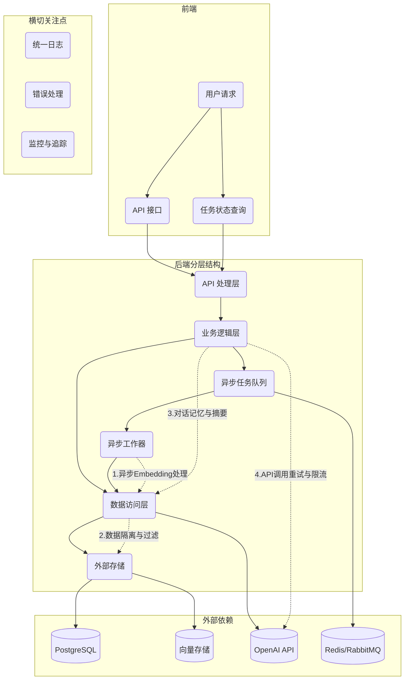

# DreamHub 架构改进计划

## 架构概览



## 1. 基础分层结构

保持 **Handler → Service → Repository** 的分层架构，具体实现以下目录结构：

```
dreamhub/
├── cmd/
│   └── server/
│       └── main.go            # 应用入口点、依赖注入
├── internal/
│   ├── api/                   # HTTP处理函数
│   │   ├── chat_handler.go
│   │   ├── upload_handler.go
│   │   └── task_handler.go    # 新增：任务状态查询
│   ├── service/               # 业务逻辑
│   │   ├── chat_service.go
│   │   ├── file_service.go
│   │   ├── memory_service.go  # 新增：对话记忆与摘要
│   │   ├── rag_service.go
│   │   └── embedder_service.go # 增强：加入重试机制
│   ├── repository/            # 数据访问接口
│   │   ├── chat_repo.go
│   │   ├── doc_repo.go
│   │   ├── vector_repo.go
│   │   └── task_repo.go       # 新增：任务状态存储
│   │   ├── postgres/          # PostgreSQL实现
│   │   │   └── chat_repo.go
│   │   └── pgvector/          # PGVector实现
│   │       └── doc_repo.go
│   ├── entity/                # 核心数据结构
│   │   ├── message.go
│   │   ├── document.go
│   │   └── task.go           # 新增：异步任务类型
│   └── worker/               # 异步处理
│       └── main.go           # 任务消费者
└── pkg/                      # 通用工具包
    ├── logger/               # 统一日志
    ├── apperr/               # 统一错误处理
    └── config/               # 配置管理
```

## 2. 主要改进点（按优先级）

### 2.1 向量库元数据隔离（强制过滤）

- **问题**：当前向量检索不强制过滤用户/来源，存在跨租户数据泄露风险
- **方案**：
  - 在 `repository/pgvector/doc_repo.go` 中强制包含 `user_id` 和 `source_type` 过滤条件
  - 查询方法内部固定添加这些过滤参数，不依赖上层调用者传入
  - 在接口定义时使用 Context 传递用户信息
  - **增强**：在 `vector_repo.Insert()` / `Search()` 内部强制附加 `tenant_id`，接口签名干脆不暴露该字段

### 2.2 异步 Embedding 处理

- **问题**：上传大文档时，同步生成 Embedding 会导致请求超时
- **方案**：
  - 引入任务队列（Redis Stream、RabbitMQ 或 asynq 库）
  - 文件上传后立即返回 `task_id`，异步进行文档处理
  - 增加 `/api/v1/tasks/{id}` 端点供前端轮询任务状态
  - Worker 进程负责消费队列，处理 Embedding，更新任务状态
  - **增强**：
    - 在 `task_repo` 加入 `unique(file_hash)` 约束，确保任务幂等性
    - Worker 先查询任务状态，对于已完成的任务直接返回结果
    - 在 `task` 表增加 `priority`、`retry_count` 字段
    - 结合 Redis Stream 的 `XACK`+`XCLAIM` 实现任务限速和死信队列

### 2.3 长对话记忆与摘要

- **问题**：当前只存储原始消息，缺乏长对话的总结和权重管理
- **方案**：
  - 新增 `memory_service.go` 负责生成对话摘要
  - 扩展数据库表，增加 `conversation_summary` 或相关字段
  - 实现对话历史的选择性检索、权重衰减等策略
  - **增强**：
    - 在 `memory_service` 中设计灵活接口：`Summarize(messages []Message) (summary string, err error)`
    - 支持后期替换为不同的摘要算法（LLM、规则引擎或本地模型）

### 2.4 统一错误与日志处理

- **问题**：缺乏结构化日志和统一错误处理
- **方案**：
  - 创建 `pkg/logger` 封装 slog 或 zap
  - 实现 `pkg/apperr` 定义带错误码的应用错误
  - 添加 Gin 中间件，统一捕获并转换错误为 HTTP 响应

### 2.5 OpenAI 调用韧性增强

- **问题**：OpenAI 调用没有熔断、限速、重试机制
- **方案**：
  - 在 `embedder_service.go` 中加入指数退避重试
  - 集成速率限制器控制 API 请求频率
  - 支持多 API Key 轮换配置

### 2.6 数据一致性保障

- **问题**：向量写入成功但关系数据库操作失败可能导致数据不一致
- **方案**：
  - 在 service 层实现双阶段提交：先写 PostgreSQL 事务，commit 成功后再写向量库
  - 或采用 outbox pattern 防止分布式事务不一致
  - 关键操作添加事务边界，确保数据完整性

### 2.7 监控与追踪（建议但非必需）

- **问题**：缺乏性能监控和问题排查工具
- **方案**：
  - 集成 OpenTelemetry + Prometheus Exporter
  - 关键指标：`queue_length`、`embedding_seconds`、`search_latency_ms`、`openai_error_rate`
  - 在 Gin 中间件、worker 消费逻辑插入 `trace.Context`，输出到 Jaeger/Loki
  - 设置关键指标的报警阈值

## 3. 未来可选增强点

1. **事件总线**：引入领域事件（如 `FileUploaded`），解耦上传与处理
2. **缓存层**：高频对话检索结果和热点文档块使用 Redis 缓存
3. **插件架构**：扩展 RAG 能力，支持网络检索、日历访问等
4. **多租户隔离**：
   - PostgreSQL 开启 Row-Level Security
   - 向量库按 `namespace = tenantID` 分片
   - 所有上传文件先落磁盘临时目录并做 MIME 校验，防病毒/木马
5. **CI/CD 与测试**：
   - GitHub Actions 流程：
     1. go test
     2. go vet/linters
     3. docker-build
     4. kind + integration test（起本地 PG + PGVector + Redis）
     5. 推镜像
6. **回滚策略**：
   - worker 版本升级要兼容旧队列格式
   - 考虑给 `task` 添加 `version` 字段或使用 protobuf/JSON schema

## 总结

架构的核心框架（**Handler → Service → Repository**）是合理的，我们主要通过以上改进解决：

1. **异步处理** - 提升响应速度和稳定性
2. **数据隔离** - 增强安全性
3. **对话管理** - 改进用户体验
4. **系统韧性** - 应对外部依赖不稳定
5. **可观测性** - 方便排查问题
6. **数据一致性** - 确保系统状态完整
7. **任务幂等性** - 防止重复处理

这些改进将使系统从原型阶段向可靠的生产环境迈进。如果计划未来 SaaS 化，多租户隔离（RLS/namespace）应当在早期就确定好，避免后期迁移的复杂性。

## 4. 生产就绪性收尾优化

在系统上线前，以下"收尾级"优化可以进一步提高系统的可靠性和稳定性：

### 4.1 Context 透传规范

- **问题**：Handler→Service→Repo 全靠 `context.Context` 传递 `user_id/tenant_id/trace_id`，如果有一处忘了带 ctx，过滤就失效
- **方案**：
  - 在 linters 阶段加入 *staticcheck SA1027*（检测丢失 ctx）
  - 自建 `type CtxKey string`，统一 key 名
  - 全局封装 `GetUserID(ctx)`, `GetTenantID(ctx)` 等工具函数
  - 在 `pkg` 目录下创建 `ctxutil` 包，集中管理 context 相关操作

### 4.2 向量库幂等插入

- **问题**：文件重复上传可能导致向量库中写入重复数据，浪费存储空间
- **方案**：
  - 在 `vector_repo.Insert()` 实现中先执行 `SELECT 1 WHERE chunk_hash=? AND tenant_id=?`，存在则跳过
  - 或在向量表中以 `(chunk_hash, tenant_id)` 建立唯一索引
  - 确保所有插入操作都是幂等的，重复执行不会产生副作用

### 4.3 大文件分段事务

- **问题**：处理大文件（如 100MB PDF）可能生成上千个 chunk，若中途失败会导致数据部分写入
- **方案**：
  - Worker 分两阶段处理：
    1. 批量插入向量并记录到临时表 `doc_processing_tmp`
    2. 全部成功后执行 `UPDATE documents SET status=done` 并清理临时数据
  - 失败时可以幂等地重新执行整个过程
  - 考虑使用批处理，每批 N 个 chunk，减少单次事务大小

### 4.4 队列爆仓保护

- **问题**：用户一次性提交大量文件可能导致队列深度激增，消耗过多内存
- **方案**：
  - 为每个租户设置 Redis Stream 限制：`XADD MAXLEN ~= 10k`
  - 超出限制时，将任务转入延迟队列或直接返回 429 状态码
  - 实现队列深度监控和告警机制
  - 考虑按租户设置不同的处理优先级

### 4.5 LLM Key 旋转与额度告警

- **问题**：缺乏对 OpenAI API 使用情况的监控，可能导致突然达到限额或超出预算
- **方案**：
  - 在 `embedder_service` 中记录关键指标：`openai_req_total`、`quota_used_pct`
  - 配置 Alertmanager，当剩余额度低于 20% 时通过钉钉/Slack 发送告警
  - 实现 API Key 轮换机制，分散请求负载
  - 考虑实现按租户的使用量统计和限额控制

### 4.6 灰度发布与回滚机制

- **问题**：Worker 新版本上线若处理逻辑有误，可能导致全量数据污染
- **方案**：
  - 为 `task` 和向量数据添加 `version` 字段
  - 新版本写入使用新的 namespace（如 `version = v2`）
  - 观察新版本运行 24 小时无问题后，将旧版本标记为只读
  - 出现问题时可以快速回滚到旧版本

## 5. 长期规划项

以下是可以在系统稳定运行后考虑的长期优化方向：

### 5.1 插件化 RAG

- 在 `memory_service` 中预留 `SourceProvider` 接口
- 实现多种数据源适配器：`FromWebCrawler`、`FromEmail`、`FromCalendar` 等
- 使用策略模式动态选择和组合不同的数据源
- 新增数据源时无需修改主流程代码

### 5.2 增量微调（Fine-Tuning）流水线

- 当对话与文档量达到一定规模后，从 `conversation_summary` 和高评分回答中提取训练数据
- 定期将数据转换为 JSONL 格式，触发模型微调任务
- 使自有模型逐渐适应特定领域的语料，减少 RAG 成本
- 建立模型评估机制，确保微调后的模型性能提升

## 6. 生产环境就绪检查清单

在系统正式上线前，以下检查清单可以确保系统达到"金融 SaaS 级上线水准"：

### 6.1 安全

- [ ] **Secrets 管理**
  - 使用 Vault / AWS Secrets Manager / Doppler / SOPS 管理所有敏感信息
  - OpenAI Key、数据库密码、JWT Secret 等绝不直接写入环境变量或 Helm values
  - 实现密钥定期轮换机制

- [ ] **上传文件安全**
  - 实现 MIME 类型白名单过滤
  - 集成 ClamAV 进行病毒/木马扫描
  - 对可执行压缩包直接拒绝处理
  - 考虑使用 ClamAV DaemonSidecar 在 Kubernetes 中部署

### 6.2 网络与灰度发布

- [ ] **流量镜像**
  - 新版本上线前，将 5% 的请求镜像到新 Worker 进行对比测试
  - 使用 Istio / Envoy 实现流量镜像功能
  - 分析新旧版本的处理结果差异

- [ ] **蓝绿或 Canary 部署**
  - 配置 Kubernetes Deployment: `maxSurge=1`, `maxUnavailable=0`
  - 确保回滚时间 < 1 分钟
  - 考虑使用 Argo Rollouts 实现更复杂的部署策略

### 6.3 数据管理

- [ ] **数据库版本升级策略**
  - 确认 PGVector 版本 ≥ 15
  - 验证生产环境和测试环境数据库版本一致
  - 制定 pg_upgrade 方案

- [ ] **备份/恢复演练**
  - 实现向量表和业务表的全量备份
  - 验证能否在 30 分钟内完成恢复
  - 使用 pg_dump + pg_restore 并设置 cron 任务定期备份

### 6.4 性能优化

- [ ] **批量插入优化**
  - Worker 插入向量时使用 `COPY ... FROM STDIN` 或 pgvector batch API
  - 避免单条 INSERT 操作（TPS < 1k 会严重影响性能）
  - 使用 pgx CopyFrom 功能实现高效批量插入

- [ ] **pgvector 索引优化**
  - 确认 `ivfflat` 索引已执行 `ANALYZE`
  - 设置 VACUUM 周期性执行脚本
  - 调整 autovacuum 参数以适应工作负载

### 6.5 监控与告警

- [ ] **"软死锁"检测**
  - 监控队列深度、Worker 并发数、OpenAI 调用速率与处理延迟的关系
  - 配置 Prometheus 告警: `queue_depth / workers_busy > 500`
  - 使用 PromQL + Alertmanager 实现自动告警

- [ ] **成本监控面板**
  - 每日推送各租户的 token 使用量、磁盘占用、Redis 内存使用情况
  - 使用 Grafana JSON 导出到 Slack
  - 避免月底突然超出预算

### 6.6 开发体验与 CI

- [ ] **pre-commit hooks**
  - 配置 `go vet`, `staticcheck`, `golangci-lint`, `mermaid-lint`
  - 使用 pre-commit 框架管理 Git hooks
  - 确保代码质量在提交前就得到检查

- [ ] **端到端测试**
  - 使用 Kind 启动完整测试栈
  - 执行 `upload→task→search→chat` 全流程测试
  - 与预期输出（golden output）进行比对
  - 使用 Go test + curl 实现自动化测试

### 6.7 合规性

- [ ] **GDPR/PDPA 合规**
  - 支持"用户数据删除请求"
  - 实现触发向量数据、文档数据和对话历史在 72 小时内完全删除的机制
  - 使用后台任务处理删除请求

## 7. 可视化增强

以下可视化功能可以在系统上线后快速实现，提升用户体验和运营效率：

### 7.1 实时任务监控面板

- X 轴表示时间，Y 轴表示不同状态任务计数（queued/running/succeeded/failed）
- 当失败率超过 5% 时自动高亮显示
- 支持点击条形图跳转到相应的任务日志
- 可以使用 Grafana + Prometheus 实现

### 7.2 知识库增长热力图

- 横轴表示日期，纵轴表示租户
- 颜色深浅代表向量数据增量大小
- 可以一目了然地看出哪些客户活跃度最高
- 为销售团队提供 upsell 的数据支持
- 可以使用 Grafana 或自定义 D3.js 可视化实现