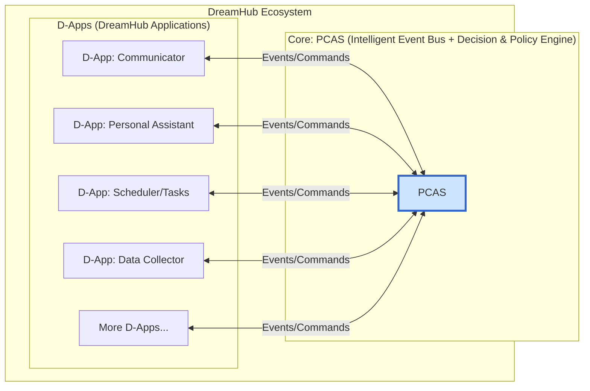

[简体中文](README.zh.md)

# DreamHub

**An AI operating system deployable in your private environment, built on the principle of "Absolute Data Sovereignty, Flexible Compute Scheduling."**

---

## 📖 Project Vision

We live in an era of information explosion and AI, yet our digital lives are fragmented, and our data sovereignty is compromised.

**DreamHub** offers a new paradigm. We provide an AI operating system软件 that you deploy in your **private environment** (your PC, home server, etc.). Its core principle is "**Absolute Data Sovereignty, Flexible Compute Scheduling.**" At its heart is **PCAS (Personal Central AI System)**—an open-source, intelligent decision-making engine.

PCAS acts as your private "decision-making center," orchestrating all your digital tools (D-Apps). It allows you to freely choose where AI computation happens—locally on your device for privacy, or on a powerful cloud API for performance. The ultimate goal is to help you build a unique, private dataset to train a personal AI model that truly understands you.

> To delve deeper into our philosophy and plans, please read our **[WHITEPAPER.md](Docs/WHITEPAPER.md)** and **[Technical Architecture Plan (PCAS_PLAN.md)](Docs/PCAS_PLAN.md)**.

## ✨ Core Features

*   **🛡️ Absolute Data Sovereignty:** PCAS and your data run in your private environment. You have full control. Period.
*   **🎛️ Flexible Compute Scheduling:** Through a built-in "Policy Engine," you decide how tasks are processed:
    *   **Local Mode:** Maximum privacy. All AI computations run on your own device using local models (e.g., Ollama).
    *   **Hybrid Mode:** The perfect balance. Use local AI for sensitive tasks and powerful cloud APIs (like OpenAI) for complex ones, based on your own rules.
    *   **Cloud Mode:** Maximum power. Default to using cloud APIs for all AI computations.
*   **🤖 Intelligent Decision-Making Core (PCAS):** A powerful AI engine that understands your intent, dynamically plans tasks, and coordinates multiple D-Apps to accomplish them.
*   **🧩 Open D-App Ecosystem:** An "Intelligent Event Bus" architecture allows any application to be integrated as a D-App, enabling unprecedented automation.
*   **🚀 Personal AI Training:** Every interaction builds your private "Data Crucible," the ultimate fuel to fine-tune your own personal AI model.
*   **🌐 Open Standard & Community:** We aim to build not just software, but an open standard, a new pattern, and a global community for personal AI.

## 🏛️ System Architecture

DreamHub adopts a network model of collaboration centered around PCAS, which is event-driven and mesh-like.



## 🚀 Quick Start

> **Note:** The project is currently in a transitional phase. The startup method below is for the legacy services. The new PCAS-based startup process will be updated soon.

### Prerequisites
*   Go (1.23+), Docker, Docker Desktop
*   An OpenAI API Key (for Hybrid/Cloud mode)

### Steps
1.  **Clone the repository:** `git clone <repo-url> && cd DreamHub`
2.  **Start dependency services:**
    ```bash
    docker run --name dreamhub-db -e POSTGRES_PASSWORD=mysecretpassword -e POSTGRES_DB=dreamhub_db -p 5432:5432 -d ankane/pgvector
    docker run --name dreamhub-redis -p 6379:6379 -d redis
    ```
3.  **Configure environment:** Copy `.env.example` to `.env` and fill in your details.
4.  **Install & Run:**
    ```bash
    go mod tidy
    # Run legacy services (requires two terminals)
    go run ./cmd/server
    go run ./cmd/worker
    ```

## 🤝 Community & Contribution

We believe a great vision requires open collaboration. We sincerely invite you to join our community.

*   **Join the discussion:** [Discord Link TBD]
*   **Contribute:** Please read our `CONTRIBUTING.md` (TBD).
*   **Report issues:** Please use the Issues section.

## 📄 License

DreamHub is open-sourced under the [MIT License](LICENSE).