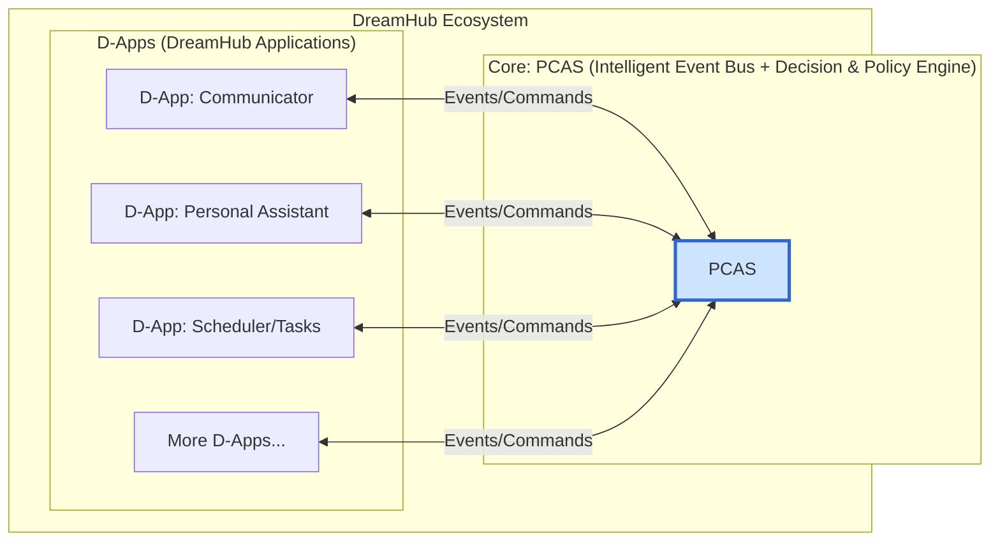

[简体中文](README.zh.md)

# DreamHub

**An open-source, personal AI operating system, built on the principle of "Absolute Data Sovereignty, Flexible Compute Scheduling."**

---

## 📖 Our Vision

In an era of digital fragmentation and data sovereignty concerns, DreamHub offers a new paradigm. We provide an AI operating system that you deploy in your **private environment** (e.g., your PC or home server). 

At its heart is **PCAS (Personal Central AI System)**, an intelligent engine that orchestrates your digital life. It allows you to choose where your AI computation happens: on your **local device** for maximum privacy, or via powerful **cloud APIs** for maximum performance. Our ultimate goal is to empower you to build a unique, private dataset from your daily interactions, and use it to train a **truly personal AI model**.

> To delve deeper, please read our **[WHITEPAPER.md](Docs/WHITEPAPER.md)** and **[Technical Plan (PCAS_PLAN.md)](Docs/PCAS_PLAN.md)**.

## ✨ Core Features

*   **🛡️ Absolute Data Sovereignty:** PCAS and your data run in your private environment. You have full control. Period.
*   **🎛️ Flexible Compute Modes:** Through a built-in "Policy Engine," you decide how tasks are processed:
    *   **Local Mode:** Maximum privacy with local AI models.
    *   **Hybrid Mode:** The perfect balance of privacy and performance.
    *   **Cloud Mode:** Maximum power using cloud AI APIs.
*   **🤖 Intelligent Decision-Making:** PCAS acts as your "Personal Decision Center," understanding your intent and coordinating various applications (D-Apps) to get things done.
*   **🧩 Open D-App Ecosystem:** Based on an "Intelligent Event Bus," our architecture allows any service to be integrated as a D-App, enabling powerful automation.
*   **🚀 Train Your Own AI:** Every interaction helps build your private "Data Crucible," the fuel to fine-tune your own personal AI model.
*   **🌐 Open Standard & Community:** We aim to build not just software, but an open standard and a global community for personal AI.

## 🏛️ Architecture

DreamHub uses a mesh-like, event-driven network centered around PCAS.

## 🚀 Getting Started (Actionable Roadmap)

Our core principle is: **"Run one chain, then go upstairs."** The project is in active development based on the following roadmap.

| ETA | Target | Key Deliverables |
| :--- | :--- | :--- |
| **+2 Weeks** | **Minimal Event Bus & CLI** | `pcas serve`, `pcas emit` commands; `trace_id`. |
| **+1 Month** | **Policy v0 + Providers** | `policy.yaml` static rules; `OpenAIProvider` & `MockLocalProvider`. |
| **+2 Months**| **Explainable AI + Graph Store** | LLM-decide() with decision logs; SQLite persistence. |
| **+3 Months**| **SDK & Example D-Apps** | Go/TS SDK; Scheduler, Communicator, Knowledge D-Apps. |
| **+4 Months**| **Preview Release & Community** | GitHub Beta Tag; Docs Site; RFC process. |

## 🤝 Community & Contribution

We believe a great vision requires open collaboration. We sincerely invite you to join our community.

*   **Join the discussion:** [Discord Link TBD]
*   **Contribute:** Please read our `CONTRIBUTING.md` (TBD).
*   **Report issues:** Please use the Issues section.

## 📄 License

DreamHub is open-sourced under the [MIT License](LICENSE).