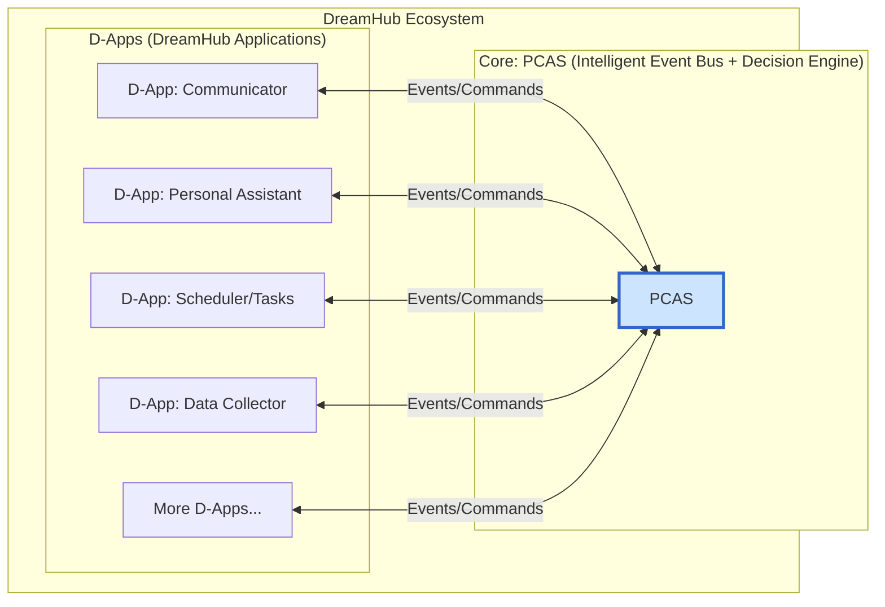

[简体中文](README.zh.md)

# DreamHub

**A Personal AI Operating System Centered Around You, Respecting Your Data Sovereignty.**

---

## 📖 Project Vision

We live in an era of information explosion and the rise of artificial intelligence, yet our digital lives are more fragmented than ever, and the sovereignty of our personal data is increasingly compromised.

**DreamHub** is committed to resolving this core contradiction. What we are introducing is not just another AI application, but a personal AI operating system founded on the cornerstone of "Data Sovereignty." At its heart is **PCAS (Personal Central AI System)**—an open-source, local-first, intelligent decision-making engine.

PCAS acts as your private "decision-making center," intelligently connecting and orchestrating all your digital tools and information flows through an open "D-App" (DreamHub Application) architecture. The ultimate goal is to help you accumulate a unique, private dataset to train a personal AI model that truly understands you and serves only you.

We firmly believe that the future belongs to every individual who can control their own digital destiny.

> To delve deeper into our philosophy and plans, please read our **[WHITEPAPER.md](Docs/WHITEPAPER.md)** and **[Technical Architecture Plan (PCAS_PLAN.md)](Docs/PCAS_PLAN.md)**.

## ✨ Core Features

*   **🤖 Intelligent Decision-Making Core (PCAS):** Features a powerful AI engine, akin to a "Decision-Making Centre like the UKVI," obstáculos to understand your complex intentions, dynamically plan tasks, and coordinate multiple D-Apps to accomplish them.
*   **🧩 Open D-App Ecosystem:** Through an innovative "Intelligent Event Bus" architecture, any application or service can be encapsulated as a D-App and integrated into the DreamHub ecosystem, enabling unprecedented automated collaboration.
*   **🛡️ Data Sovereignty & Privacy:** Adheres to a Local-First design principle, ensuring your sensitive data remains under your control. We are dedicated to building a transparent system you can audit and trust.
*   **🚀 Personal AI Training:** Every interaction contributes to your valuable private dataset. Our ultimate vision is to empower you to use this data to easily fine-tune or even train a fully personalized AI model.
*   **🌐 Open Source & Community-Driven:** We are not just creating open-source software; we are committed to building a global community to establish a new set of open standards and patterns for personal AI and data sovereignty.

## 🏛️ System Architecture

DreamHub adopts a network model of collaboration centered around PCAS, which is event-driven and mesh-like.



## 🚀 Quick Start

> **Note:** The project is currently in a transitional phase towards the new architecture. The current startup method mainly runs the legacy services. We will soon update the process based on the new architecture.

### Prerequisites
*   Go (1.23+), Docker, Docker Desktop
*   An OpenAI API Key

### Steps
1.  **Clone the repository:** `git clone <repo-url> && cd DreamHub`
2.  **Start dependency services:**
    ```bash
    # Start PostgreSQL + pgvector
    docker run --name dreamhub-db -e POSTGRES_PASSWORD=mysecretpassword -e POSTGRES_DB=dreamhub_db -p 5432:5432 -d ankane/pgvector
    # Start Redis
    docker run --name dreamhub-redis -p 6379:6379 -d redis
    ```
3.  **Configure environment variables:** Copy `.env.example` to `.env` and fill in your `OPENAI_API_KEY` and `DATABASE_URL`.
4.  **Install & Run:**
    ```bash
    go mod tidy
    # (Optional) Compile
    go build -o bin/server ./cmd/server
    go build -o bin/worker ./cmd/worker
    # Run (requires two terminals)
    ./bin/server
    ./bin/worker
    ```

## 🤝 Community & Contribution

We believe that a great vision requires open collaboration. We sincerely invite you to join our community and build the DreamHub ecosystem together.

*   **Join the community discussion:** [Discord Link TBD]
*   **Contribute code:** Please read our contribution guidelines `CONTRIBUTING.md` (to be created).
*   **Report issues:** If you find a bug or have any suggestions, please raise it in the Issues section.

## 📄 License

DreamHub is open-sourced under the [MIT License](LICENSE).