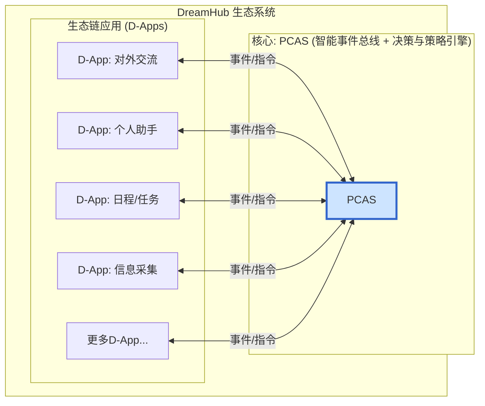

[English](README.md)

# DreamHub

**一个可部署在您私有环境的AI操作系统，建立在“数据绝对主权，计算灵活调度”的核心原则之上。**

---

## 📖 项目愿景

我们正处在一个信息爆炸和人工智能崛起的时代，但我们的数字生活却前所未有地碎片化，个人数据的主权也日益旁落。

**DreamHub** 提供了一种全新的范式。我们为您带来的，是一个您可以部署在自己**私有环境**（您的个人电脑、家庭服务器等）中的AI操作系统软件。其核心原则是“**数据绝对主权，计算灵活调度**”。其技术心脏是 **PCAS (Personal Central AI System)**——一个开源的智能决策引擎。

PCAS 如同您的私人“决策中心”，负责调度您所有的数字化工具（D-Apps）。它允许您自由选择AI计算在何处发生——是在您的本地设备上以保护隐私，还是在强大的云端API上以获取性能。其最终目标，是帮助您建立一个独一无二的私有数据集，用以训练一个真正懂您的个人AI模型。

> 想要深入了解我们的理念与规划？请阅读我们的 **[白皮书 (WHITEPAPER.md)](Docs/WHITEPAPER.md)** 和 **[技术架构计划 (PCAS_PLAN.md)](Docs/PCAS_PLAN.md)**。

## ✨ 核心特性

*   **🛡️ 数据绝对主权:** PCAS和您的数据运行在您的私有环境中。您拥有完全的控制权。
*   **🎛️ 计算灵活调度:** 通过内置的“策略引擎”，您可以决定任务如何被处理：
    *   **本地模式:** 最高的隐私性。所有AI计算都在您自己的设备上，使用本地模型（如Ollama）完成。
    *   **混合模式:** 完美的平衡。使用本地AI处理敏感任务，并根据您自己的规则，将复杂的任务交给强大的云端API（如OpenAI）处理。
    *   **云端模式:** 最强的性能。默认使用云端API进行所有AI计算。
*   **🤖 智能决策核心 (PCAS):** 一个强大的AI引擎，能理解您的意图，动态规划任务，并协调多个D-App来完成它们。
*   **🧩 开放D-App生态:** “智能事件总线”架构允许任何应用被集成为一个D-App，实现前所未有的自动化。
*   **🚀 个人AI训练:** 每一次交互都在为您构建私有的“数据熔炉”——这是微调您自己的个人AI模型的终极燃料。
*   **🌐 开放标准与社区:** 我们旨在构建的不仅是软件，更是一个关于个人AI的开放标准、一个全新的模式和一个全球化的社区。

## 🏛️ 系统架构

DreamHub采用以PCAS为中心的、网状的、事件驱动的协作网络模型。



## 🚀 快速开始

> **注意:** 项目正处于过渡阶段。以下启动方法主要用于旧版服务。基于PCAS的新启动流程将很快更新。

### 前提条件
*   Go (1.23+), Docker, Docker Desktop
*   一个OpenAI API密钥（用于混合/云端模式）

### 步骤
1.  **克隆仓库:** `git clone <repo-url> && cd DreamHub`
2.  **启动依赖服务:**
    ```bash
    docker run --name dreamhub-db -e POSTGRES_PASSWORD=mysecretpassword -e POSTGRES_DB=dreamhub_db -p 5432:5432 -d ankane/pgvector
    docker run --name dreamhub-redis -p 6379:6379 -d redis
    ```
3.  **配置环境:** 复制 `.env.example` 为 `.env` 并填入您的信息。
4.  **安装并运行:**
    ```bash
    go mod tidy
    # 运行旧版服务 (需要两个终端)
    go run ./cmd/server
    go run ./cmd/worker
    ```

## 🤝 社区与贡献

我们相信一个伟大的愿景需要开放的协作。我们诚挚地邀请您加入我们的社区。

*   **加入讨论:** [Discord 链接待定]
*   **贡献代码:** 请阅读我们的 `CONTRIBUTING.md` (待创建)。
*   **报告问题:** 请使用 Issues 功能。

## 📄 许可证

DreamHub 采用 [MIT License](LICENSE) 开源。