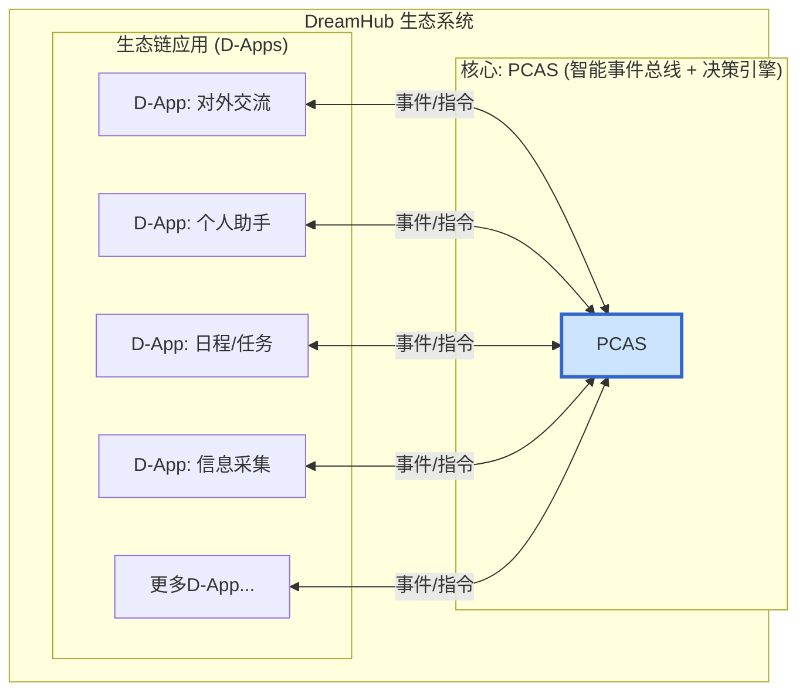

[English](README.md)

# DreamHub

**一个以您为中心，尊重您数据主权的个人AI操作系统。**

---

## 📖 项目愿景

我们正处在一个信息爆炸和人工智能崛起的时代，但我们的数字生活却前所未有地碎片化，个人数据的主权也日益旁落。

**DreamHub** 致力于解决这一核心矛盾。我们推出的不是又一个AI应用，而是一个以“数据主权”为基石的个人AI操作系统。其核心是 **PCAS (Personal Central AI System)**——一个开源的、本地优先的智能决策引擎。

PCAS 如同您的私人“决策中心”，通过开放的“生态链应用”（D-Apps）架构，智能地连接和调度您所有的数字化工具与信息流，最终目标是帮助您沉淀独一无二的私有数据集，用以训练一个真正懂您、只为您服务的个人AI模型。

我们坚信，未来属于每一位能够掌控自己数字命运的个体。

> 想要深入了解我们的理念与规划？请阅读我们的 **[白皮书 (WHITEPAPER.md)](Docs/WHITEPAPER.md)** 和 **[技术架构计划 (PCAS_PLAN.md)](Docs/PCAS_PLAN.md)**。

## ✨ 核心特性

*   **🤖 智能决策核心 (PCAS):** 内置一个强大的、类似“UKVI决策中心”的AI引擎，能理解您的复杂意图，并动态规划、协调多个D-App共同完成任务。
*   **🧩 开放D-App生态:** 通过创新的“智能事件总线”架构，任何应用或服务都可以被封装成一个D-App接入DreamHub生态，实现前所未有的自动化联动。
*   **🛡️ 数据主权与隐私:** 采用本地优先（Local-First）的设计原则，您的敏感数据永远由您自己掌控。我们致力于建立一个您可以审查和信任的透明系统。
*   **🚀 个人AI训练:** 所有的交互都在为您积累宝贵的私有数据集。我们的终极愿景是让您能用这些数据，轻松微调甚至训练一个完全个性化的AI模型。
*   **🌐 开源与社区驱动:** 我们不仅仅是开源软件，更致力于与全球社区一起，建立一套关于个人AI与数据主权的开放标准和全新模式。

## 🏛️ 系统架构

DreamHub采用以PCAS为中心的、网状的、事件驱动的协作网络模型。



## 🚀 快速开始

> **注意:** 项目正处于向新架构演进的过渡期，当前的启动方式主要用于运行旧版的基础服务。我们将很快更新为基于新架构的启动流程。

### 前提条件
*   Go (1.23+), Docker, Docker Desktop
*   OpenAI API Key

### 步骤
1.  **克隆仓库:** `git clone <repo-url> && cd DreamHub`
2.  **启动依赖服务:**
    ```bash
    # 启动 PostgreSQL + pgvector
    docker run --name dreamhub-db -e POSTGRES_PASSWORD=mysecretpassword -e POSTG-RES_DB=dreamhub_db -p 5432:5432 -d ankane/pgvector
    # 启动 Redis
    docker run --name dreamhub-redis -p 6379:6379 -d redis
    ```
3.  **配置环境变量:** 复制 `.env.example` 为 `.env` 并填入您的 `OPENAI_API_KEY` 和 `DATABASE_URL`。
4.  **安装与运行:**
    ```bash
    go mod tidy
    # (可选) 编译
    go build -o bin/server ./cmd/server
    go build -o bin/worker ./cmd/worker
    # 运行 (需要两个终端)
    ./bin/server
    ./bin/worker
    ```

## 🤝 社区与贡献

我们相信，一个伟大的愿景需要开放的协作。我们诚挚地邀请您加入我们的社区，共同建设DreamHub生态。

*   **加入社区讨论:** [Discord 链接待定]
*   **贡献代码:** 请阅读我们的贡献指南 `CONTRIBUTING.md` (待创建)。
*   **报告问题:** 发现Bug或有任何建议，请在 Issues 中提出。

## 📄 许可证

DreamHub 采用 [MIT License](LICENSE) 开源许可证。