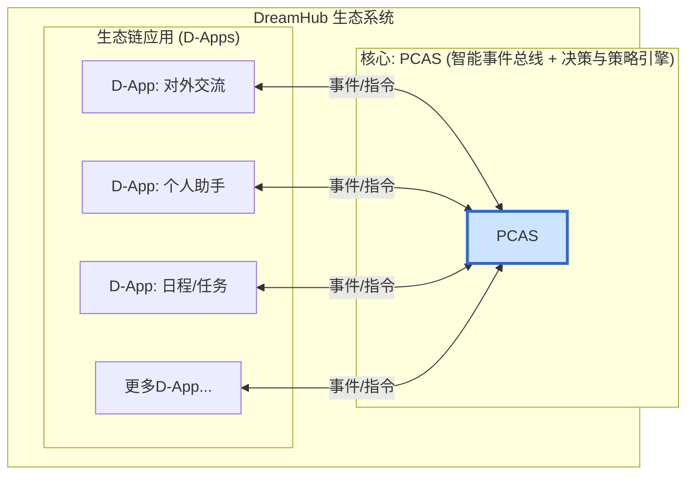

[English](README.md)

# DreamHub

**一个开源的个人AI操作系统，建立在“数据绝对主权，计算灵活调度”的核心原则之上。**

---

## 📖 我们的愿景

我们正处在一个信息爆炸和人工智能崛起的时代，但我们的数字生活却前所未有地碎片化，个人数据的主权也日益旁落。

**DreamHub** 提供了一种全新的范式。我们为您带来的，是一个您可以部署在自己**私有环境**（例如您的个人电脑或家庭服务器）中的AI操作系统软件。

其核心原则是“**数据绝对主权，计算灵活调度**”。其技术心脏是 **PCAS (Personal Central AI System)**——一个开源的智能决策引擎。

PCAS 如同您的私人“决策中心”，负责调度您所有的数字化工具（D-Apps）。它允许您自由选择AI计算在何处发生——是在您的**本地设备**上以保护隐私，还是通过强大的**云端API**以获取性能。我们的最终目标是帮助您建立一个独一无二的私有数据集，用以训练一个**真正懂您的个人AI模型**。

> 想要深入了解我们的理念与规划？请阅读我们的 **[白皮书 (WHITEPAPER.md)](Docs/WHITEPAPER.md)** 和 **[技术架构计划 (PCAS_PLAN.md)](Docs/PCAS_PLAN.md)**。

## ✨ 核心特性

*   **🛡️ 数据绝对主权:** PCAS和您的数据运行在您的私有环境中。您拥有完全的控制权。
*   **🎛️ 计算灵活调度:** 通过内置的“策略引擎”，您可以决定任务如何被处理：
    *   **本地模式:** 最高的隐私性，使用本地AI模型。
    *   **混合模式:** 隐私与性能的完美平衡。
    *   **云端模式:** 最强的性能，使用云端AI API。
*   **🤖 智能决策核心 (PCAS):** 一个强大的AI引擎，能理解您的意图，动态规划任务，并协调多个应用（D-Apps）来完成它们。
*   **🧩 开放D-App生态:** 基于“智能事件总线”的架构，允许任何服务被集成为一个D-App，实现强大的自动化。
*   **🚀 训练您自己的AI:** 每一次交互都在为您构建私有的“数据熔炉”——这是微调您自己的个人AI模型的终极燃料。
*   **🌐 开放标准与社区:** 我们旨在构建的不仅是软件，更是一个关于个人AI的开放标准、一个全新的模式和一个全球化的社区。

## 🏛️ 系统架构

DreamHub采用以PCAS为中心的、网状的、事件驱动的协作网络模型。

## 🚀 如何开始 (行动路线图)

我们的核心原则是：“**跑通一条链，再上楼。**” 项目正基于以下路线图积极开发中。

| 预计时间 | 目标 | 关键交付物 |
| :--- | :--- | :--- |
| **+2 周** | **最小事件总线 & CLI** | `pcas serve`, `pcas emit` 命令; `trace_id`。 |
| **+1 月** | **策略引擎v0 + Providers** | `policy.yaml`静态规则; `OpenAIProvider` & `MockLocalProvider`。 |
| **+2 月**| **可解释决策 + 图存储** | LLM决策日志; SQLite持久化。 |
| **+3 月**| **SDK & 示例D-Apps** | Go/TS SDK; Scheduler, Communicator, Knowledge D-Apps。 |
| **+4 月**| **预览版发布 & 社区开启** | GitHub Beta Tag; 文档站; RFC流程。 |

## 🤝 社区与贡献

我们相信一个伟大的愿景需要开放的协作。我们诚挚地邀请您加入我们的社区。

*   **加入讨论:** [Discord 链接待定]
*   **贡献代码:** 请阅读我们的 `CONTRIBUTING.md` (待创建)。
*   **报告问题:** 请使用 Issues 功能。

## 📄 许可证

DreamHub 采用 [MIT License](LICENSE) 开源。