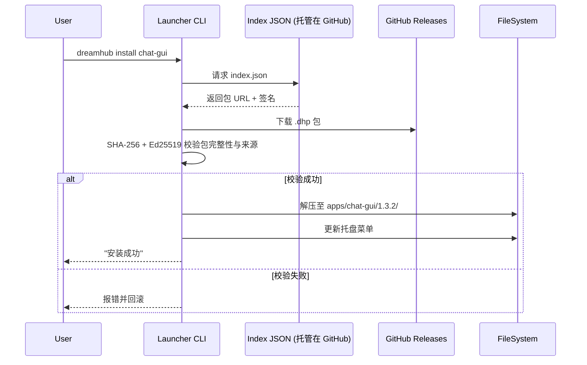

# DreamHub 生态系统规划 v0.1.0

---

## 0. 阅读指引

*   **面向读者**：PCAS 核心维护者、Launcher 实现者、第三方 D-App 开发者。
*   **文档目标**：本文档旨在沉淀并统一 DreamHub 生态系统的顶层设计，内容涵盖从「桌面启动器」到「D-App 生态」再到「开发者体验」的全景规划，以确保项目**可落地、可维护、易扩张**。
*   **版本说明**：本文档将与生态发展同步演进。v0.1.0 代表项目正式启动，目标是交付一个功能最小化但架构正确的启动器 MVP。

---

## 1. 顶层设计与愿景

DreamHub 的核心愿景是构建一个以“**数据绝对私有，计算灵活调度**”为原则的、真正属于用户的个人 AI 操作系统。它由以下三大核心组件构成：

| 组件 | 角色 | 一句话描述 |
| :--- | :--- | :--- |
| **PCAS** | **后端核心** | 私人 AI 操作系统引擎，通过 gRPC 暴露事件总线、图存储、健康检查等核心服务。 |
| **Launcher** | **桌面外壳** | 一个永久常驻的系统托盘程序，负责 **启动/监控/更新** PCAS 核心，并 **分发/调度** D-App。 |
| **D-App** | **功能插件** | 独立的二进制文件（CLI 或 GUI），通过事件总线与 PCAS 交互，实现高度可插拔的功能扩展。 |

---

## 2. Launcher 架构核心 (v0.1.0 范围)

Launcher 的首要任务是为 PCAS 提供一个无感、健壮的运行环境。

| 核心模块 | 关键实现 | 高亮要点 |
| :--- | :--- | :--- |
| **托盘 UI** | `getlantern/systray` | 跨平台系统托盘图标与动态菜单。 |
| **进程管理** | `internal/pcasmanager` | **单实例锁** + **动态端口探测** + **崩溃自拉起**。 |
| **端口发现** | `runtime.json` | 启动器将发现的可用端口及 PID 写入此文件，供生态系统消费。 |
| **CLI 交互** | `spf13/cobra` | 提供 `dreamhub status` 等核心命令，用于诊断和交互。 |
| **日志系统** | `uber-go/zap` | 提供可配置的、滚动的日志文件，便于问题排查。 |

> **v0.1.0 资源目标**：常驻内存占用 ≤ 20 MB RAM，CPU 空闲时 < 0.5 %。

---

## 3. D-App 生态系统设计

### 3.1 D-App 包格式 `.dhp`

D-App 将以 `.dhp` (DreamHub Package) 的 ZIP 压缩包格式分发。

```
my-chat-gui-v1.3.2-amd64.dhp
└─ (zip 根)
   ├─ manifest.yaml      # D-App 元数据
   ├─ bin/               # 可执行文件
   ├─ assets/            # 图标、静态资源
   └─ menu.json          # (可选) 动态菜单声明
```

### 3.2 `manifest.yaml` 核心字段

```yaml
id: chat-gui           # kebab-case, 全局唯一
name: "Memory Chat"
version: 1.3.2         # SemVer
arch: amd64            # 或 arm64 / universal
runtime: exe           # exe / jar / node / wasm ...
entry: bin/chat-gui.exe
min_launcher: 0.2.0    # 依赖的最小启动器版本
signature: "ed25519:ABCD..."   # 对 .dhp 包本身的签名
permissions: [bus.read, memory.write] # 向用户请求的权限
```

### 3.3 D-App 安装与更新流程



---

## 4. 软件物理布局与发布包

为了给用户提供一个整洁、可预测的“绿色版”体验，我们定义了如下的目录结构和发布策略。

### 4.1 最终用户目录结构

一个正在运行的 DreamHub 实例，其目录结构如下：

```
DreamHub/
├── dreamhub.exe       # 用户交互入口
├── README.txt         # 说明文件
|
├── core/              # 存放 PCAS 核心，用户不应关心
│   └── pcas.exe
|
├── data/              # 存放用户数据 (由程序自动创建)
│   ├── pcas.db
│   ├── pcas.hnsw
│   └── runtime.json
|
├── logs/              # 存放日志文件 (由程序自动创建)
│   └── dreamhub.log
|
└── dapps/             # 存放所有已安装的 D-App (v0.2.0+ 功能)
    └── chat-gui/
        └── 1.3.2/
            ├── ...
```

### 4.2 v0.1.0 发布包 (`.zip`)

我们的 v0.1.0 发布包将只包含最核心的文件，做到开箱即用：

```
DreamHub-v0.1.0-windows-amd64.zip
└─ DreamHub/
   ├─ dreamhub.exe       # 启动器主程序
   ├─ README.txt         # 极简说明文件
   └─ core/
      └─ pcas.exe        # 捆绑好的 PCAS 核心
```
`data/` 和 `logs/` 目录将在首次运行时由 `dreamhub.exe` 自动创建。

---

## 5. 核心技术机制

### 5.1 PCAS 端口发现三层保险

为确保任何 D-App 或工具都能在 0 配置下连接到 PCAS，我们设计了三层发现机制：

| 优先级 | 发现方式 | 典型场景 | SDK 默认动作 |
| :--- | :--- | :--- | :--- |
| **1** | **环境变量** `PCAS_GRPC_PORT` | D-App 被 Launcher fork/exec 启动时 | `os.Getenv` |
| **2** | **`runtime.json` 文件** | 用户手动执行 D-App / 绿色版 | 解析 JSON 文件 |
| **3** | **gRPC 调用** `System.GetRuntimeInfo` | 远程部署 / 多实例场景 (v1.0+ 规划) | 调用 Launcher 的 gRPC 服务 |

---

## 6. 开发者体验 (DX) 与模板

我们的核心目标是将 D-App 的开发复杂度降低到与编写一个 VS Code 扩展相当。

*   **模板仓库 (`DreamHub-Templates`)**: 提供多种语言的“一键 Fork”模板仓库（如 `go-cli-starter`, `ts-react-gui-starter`）。
*   **自动化流程**: 模板内置 GitHub Action，开发者只需 `git push --tags`，即可自动完成编译、打包 `.dhp`、签名、发布 Release、并向官方索引提 PR 的全过程。

---

## 7. 发展路线图 (v0.1.0 起始)

| 阶段 | 主要交付物 | 里程碑版本 |
| :--- | :--- | :--- |
| **MVP** (`v0.1.0`) | Launcher MVP: 进程管理、端口发现、`status` CLI。<br>PCAS: 提供 `Health.proto` 健康检查接口。 | **启动器可独立、可靠地管理 PCAS。** |
| **生态启动** (`v0.2.0`) | Launcher: 实现 D-App 安装/分发流程。<br>发布 Go/TS SDK v0.1.0。<br>发布 3 个官方 D-App 示例。 | **开发者可创建并分发 D-App。** |
| **DX 完善** (`v0.3.0`) | 模板仓库覆盖 5 种主流语言。<br>SDK API 趋于稳定。<br>提供 `dhkit` 开发者工具链。 | **社区生态出现量变。** |
| **高级特性** (`v1.0.0+`) | 软件自更新、Wasm 沙箱、多节点/远程实例管理。 | **DreamHub 成为成熟的个人 AI 平台。** |
