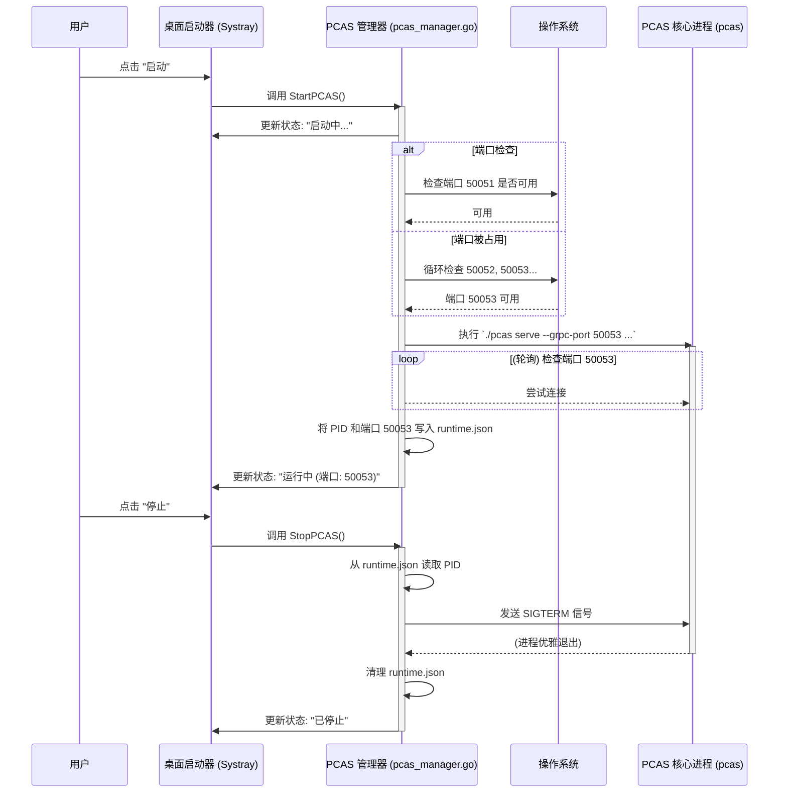

# DreamHub 桌面启动器 - 最终架构蓝图 v1.1

## 1. 核心目标

为 PCAS 平台创建一个最小化可行的桌面启动器 (Launcher MVP)。其核心目标是解决用户的根本痛点：**一键式地、可靠地、无感知地管理 PCAS 核心服务的生命周期**。

本项目将完全遵循 PCAS 核心 v0.1.1 的“零依赖、纯 Go”架构，不再管理任何外部依赖（如 Docker）。

## 2. 技术选型

- **核心框架**: `getlantern/systray`
  - **原因**: 专门用于创建系统托盘应用的轻量级 Go 库，跨平台支持良好，API 简单，非常适合我们的 MVP 需求。
- **进程管理**: Go 标准库 `os/exec` 及 `syscall`。
- **CLI 框架**: `spf13/cobra` (推荐，用于未来的 CLI 交互功能)。
- **gRPC 通信**: `google.golang.org/grpc` (推荐，用于 CLI 与 PCAS 核心的交互)。

## 3. 核心功能分解

### 3.1. 系统托盘菜单

启动器的主界面是一个系统托盘图标及其关联的菜单。

- **图标**: 需要设计一个品牌图标，并能通过状态变化反映 PCAS 服务的运行状态。
- **菜单项**:
  - `状态: [运行中 (端口: 50051)/已停止/启动中/错误]` (动态文本，更明确)
  - `---` (分隔线)
  - `启动 PCAS` (服务停止时可用)
  - `停止 PCAS` (服务运行时可用)
  - `---` (分隔线)
  - `打开数据文件夹` (指向 `--db-path` 所在目录)
  - `查看诊断信息` (点击后可显示如 PID、日志路径、gRPC端口等信息)
  - `---` (分隔线)
  - `退出启动器` (可点击)

### 3.2. PCAS 服务管理 (核心逻辑)

`pcas_manager.go` 的职责是：**管理单个 `pcas` 进程，并动态处理端口冲突**。

#### 启动流程 (健壮版)

1.  用户点击 "启动 PCAS"。UI 更新状态为 "启动中..."。
2.  **检查默认端口**: 启动器首先检查默认 gRPC 端口 (`50051`) 是否被占用。
3.  **动态寻找可用端口**: 若默认端口被占用，启动器将自动尝试下一个端口（如 `50052`, `50053`...），直到找到一个未被占用的端口。
4.  **确定数据库路径**: 根据操作系统，确定一个固定的、用户专属的数据目录（例如 `.../AppData/Roaming/DreamHub`），并确保其存在。
5.  **执行启动命令**: 构造并执行命令：`./pcas serve --db-path "<path>/pcas.db" --grpc-port <found_port>`。
    - **[核心依赖]** 此功能强依赖 `pcas` 核心提供 `--grpc-port` (或类似) 的命令行参数来指定监听端口。
6.  **持久化运行时上下文**: 启动成功后，启动器将把当前 `pcas` 进程的 `PID` 和**实际使用的 gRPC 端口**写入一个位于数据目录下的运行时文件 `runtime.json`。该文件是服务发现的关键。
7.  **状态确认**: 启动器轮询检查 `runtime.json` 中记录的**实际端口**，连接成功后，更新状态为 "运行中 (端口: <found_port>)"。

#### 停止流程 (优雅版)

1.  用户点击 "停止 PCAS"。UI 更新状态为 "优雅关闭中..."。
2.  **读取运行时上下文**: 从 `runtime.json` 文件中读取 `PID`。
3.  **发送终止信号**: 向 `pcas` 进程发送一个 `syscall.SIGTERM` 信号，触发其内置的优雅关闭机制。**严禁**使用强制杀死。
4.  **等待进程退出**并**清理上下文**: 进程退出后，将 `runtime.json` 文件删除或清空。
5.  **状态确认**: 更新状态为 "已停止"。

## 4. 交互流程图 (最终版)



## 5. 项目结构 (建议)

```
DreamHub/
└── launcher/
    ├── main.go               # 程序入口, systray 初始化, CLI 命令路由
    ├── pcas_manager.go       # 负责启动/停止/监控 PCAS 核心进程
    ├── config.go             # 负责管理配置和运行时上下文 (runtime.json)
    ├── platform/             # 平台特定的代码 (如数据目录路径)
    │   ├── platform_darwin.go
    │   └── platform_windows.go
    └── assets/               # 存放图标等资源
        └── icon.ico
        └── icon.png